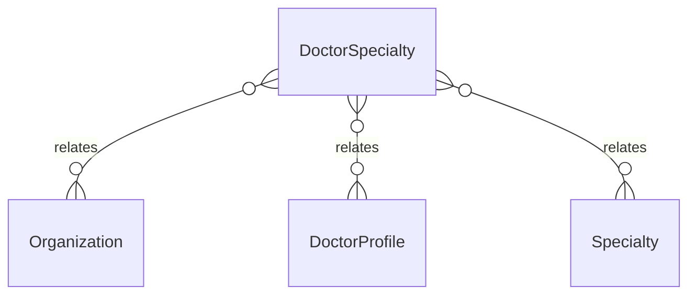

# `DoctorSpecialty` → `doctor_specialties`

<!-- generated by .kb/generate.mjs — do not edit by hand -->

Declared at `packages/db/prisma/schema/doctors.prisma:279`.

| property | value |
| --- | --- |
| table | `doctor_specialties` |
| tenant-scoped | yes — has `organizationId` |
| RLS | `org` policy |
| columns | 11 |
| relations | 3 |

## Columns

| column | type | definition |
| --- | --- | --- |
| `id` | `String` | `id String @id @default(uuid()) @db.Uuid` |
| `organizationId` | `String` | `organizationId String @map("organization_id") @db.Uuid` |
| `doctorProfileId` | `String` | `doctorProfileId String @map("doctor_profile_id") @db.Uuid` |
| `specialtyId` | `String` | `specialtyId String @map("specialty_id") @db.Uuid` |
| `isPrimary` | `Boolean` | `isPrimary Boolean @default(false) @map("is_primary")` |
| `proficiency` | `SpecialtyProficiency?` | `proficiency SpecialtyProficiency?` |
| `effectiveFrom` | `DateTime?` | `effectiveFrom DateTime? @map("effective_from") @db.Date` |
| `effectiveTo` | `DateTime?` | `effectiveTo DateTime? @map("effective_to") @db.Date` |
| `isActive` | `Boolean` | `isActive Boolean @default(true) @map("is_active")` |
| `createdAt` | `DateTime` | `createdAt DateTime @default(now()) @map("created_at") @db.Timestamptz(6)` |
| `updatedAt` | `DateTime` | `updatedAt DateTime @updatedAt @map("updated_at") @db.Timestamptz(6)` |

## Relations

| field | target | definition |
| --- | --- | --- |
| `organization` | [`Organization`](Organization.md) | `organization Organization @relation(fields: [organizationId], references: [id], onDelete: Cascade)` |
| `doctorProfile` | [`DoctorProfile`](DoctorProfile.md) | `doctorProfile DoctorProfile @relation(fields: [doctorProfileId], references: [id], onDelete: Cascade)` |
| `specialty` | [`Specialty`](Specialty.md) | `specialty Specialty @relation(fields: [specialtyId], references: [id], onDelete: Restrict)` |

## Indexes and constraints

- `@@unique([organizationId, doctorProfileId, specialtyId])`
- `@@index([organizationId, specialtyId])`

## Neighbourhood

