# `Encounter` → `encounters`

<!-- generated by .kb/generate.mjs — do not edit by hand -->

Declared at `packages/db/prisma/schema/clinical.prisma:859`.

| property | value |
| --- | --- |
| table | `encounters` |
| tenant-scoped | yes — has `organizationId` |
| RLS | **MISSING — this is a tenant-isolation defect** |
| columns | 29 |
| relations | 22 |

## Columns

| column | type | definition |
| --- | --- | --- |
| `id` | `String` | `id String @id @default(uuid()) @db.Uuid` |
| `organizationId` | `String` | `organizationId String @map("organization_id") @db.Uuid` |
| `branchId` | `String` | `branchId String @map("branch_id") @db.Uuid` |
| `patientId` | `String` | `patientId String @map("patient_id") @db.Uuid` |
| `appointmentId` | `String?` | `appointmentId String? @map("appointment_id") @db.Uuid` |
| `clinicalEpisodeId` | `String` | `clinicalEpisodeId String @map("clinical_episode_id") @db.Uuid` |
| `doctorProfileId` | `String` | `doctorProfileId String @map("doctor_profile_id") @db.Uuid` |
| `encounterNumber` | `String?` | `encounterNumber String? @map("encounter_number") @db.VarChar(32)` |
| `templateId` | `String` | `templateId String @map("template_id") @db.Uuid` |
| `templateVersionId` | `String` | `templateVersionId String @map("template_version_id") @db.Uuid` |
| `templateSnapshot` | `Json` | `templateSnapshot Json @map("template_snapshot") @db.JsonB` |
| `status` | `EncounterStatus` | `status EncounterStatus @default(DRAFT)` |
| `chiefComplaint` | `String?` | `chiefComplaint String? @map("chief_complaint") @db.Text` |
| `chiefComplaintDurationValue` | `Int?` | `chiefComplaintDurationValue Int? @map("chief_complaint_duration_value") @db.SmallInt` |
| `chiefComplaintDurationUnit` | `ClinicalDurationUnit?` | `chiefComplaintDurationUnit ClinicalDurationUnit? @map("chief_complaint_duration_unit")` |
| `onset` | `ClinicalOnset?` | `onset ClinicalOnset?` |
| `clinicalNotes` | `String?` | `clinicalNotes String? @map("clinical_notes") @db.Text` |
| `startedAt` | `DateTime` | `startedAt DateTime @default(now()) @map("started_at") @db.Timestamptz(6)` |
| `finalizedAt` | `DateTime?` | `finalizedAt DateTime? @map("finalized_at") @db.Timestamptz(6)` |
| `finalizedBy` | `String?` | `finalizedBy String? @map("finalized_by") @db.Uuid` |
| `amendsEncounterId` | `String?` | `amendsEncounterId String? @map("amends_encounter_id") @db.Uuid` |
| `amendedAt` | `DateTime?` | `amendedAt DateTime? @map("amended_at") @db.Timestamptz(6)` |
| `amendmentReason` | `String?` | `amendmentReason String? @map("amendment_reason") @db.Text` |
| `cancelledAt` | `DateTime?` | `cancelledAt DateTime? @map("cancelled_at") @db.Timestamptz(6)` |
| `cancelledBy` | `String?` | `cancelledBy String? @map("cancelled_by") @db.Uuid` |
| `cancelledReason` | `String?` | `cancelledReason String? @map("cancelled_reason") @db.Text` |
| `createdAt` | `DateTime` | `createdAt DateTime @default(now()) @map("created_at") @db.Timestamptz(6)` |
| `updatedAt` | `DateTime` | `updatedAt DateTime @updatedAt @map("updated_at") @db.Timestamptz(6)` |
| `deletedAt` | `DateTime?` | `deletedAt DateTime? @map("deleted_at") @db.Timestamptz(6)` |

## Relations

| field | target | definition |
| --- | --- | --- |
| `organization` | [`Organization`](Organization.md) | `organization Organization @relation(fields: [organizationId], references: [id], onDelete: Cascade)` |
| `branch` | [`Branch`](Branch.md) | `branch Branch @relation(fields: [organizationId, branchId], references: [organizationId, id], onDelete: Cascade)` |
| `patient` | [`Patient`](Patient.md) | `patient Patient @relation(fields: [organizationId, patientId], references: [organizationId, id], onDelete: Cascade)` |
| `appointment` | [`Appointment`](Appointment.md) | `appointment Appointment? @relation(fields: [organizationId, appointmentId], references: [organizationId, id], onDelete: Restrict, onUpdate: NoAction)` |
| `clinicalEpisode` | [`ClinicalEpisode`](ClinicalEpisode.md) | `clinicalEpisode ClinicalEpisode @relation(fields: [organizationId, clinicalEpisodeId], references: [organizationId, id], onDelete: Restrict)` |
| `doctorProfile` | [`DoctorProfile`](DoctorProfile.md) | `doctorProfile DoctorProfile @relation(fields: [organizationId, doctorProfileId], references: [organizationId, id], onDelete: Restrict)` |
| `template` | [`ConsultationTemplate`](ConsultationTemplate.md) | `template ConsultationTemplate @relation(fields: [templateId], references: [id], onDelete: Restrict)` |
| `templateVersion` | [`ConsultationTemplateVersion`](ConsultationTemplateVersion.md) | `templateVersion ConsultationTemplateVersion @relation(fields: [templateVersionId], references: [id], onDelete: Restrict)` |
| `finalizer` | [`User`](User.md) | `finalizer User? @relation("EncounterFinalizedBy", fields: [finalizedBy], references: [id], onDelete: Restrict)` |
| `canceller` | [`User`](User.md) | `canceller User? @relation("EncounterCancelledBy", fields: [cancelledBy], references: [id], onDelete: SetNull)` |
| `amends` | [`Encounter`](Encounter.md) | `amends Encounter? @relation("EncounterAmendment", fields: [organizationId, amendsEncounterId], references: [organizationId, id], onDelete: Restrict, onUpdate: NoAction)` |
| `amendedBy` | [`Encounter`](Encounter.md) | `amendedBy Encounter[] @relation("EncounterAmendment")` |
| `sections` | [`EncounterSection`](EncounterSection.md) | `sections EncounterSection[]` |
| `recommendations` | [`EncounterFollowUpRecommendation`](EncounterFollowUpRecommendation.md) | `recommendations EncounterFollowUpRecommendation[]` |
| `symptoms` | [`EncounterSymptom`](EncounterSymptom.md) | `symptoms EncounterSymptom[]` |
| `diagnoses` | [`EncounterDiagnosis`](EncounterDiagnosis.md) | `diagnoses EncounterDiagnosis[]` |
| `procedures` | [`EncounterProcedure`](EncounterProcedure.md) | `procedures EncounterProcedure[]` |
| `prescriptions` | [`EncounterPrescription`](EncounterPrescription.md) | `prescriptions EncounterPrescription[]` |
| `investigations` | [`EncounterInvestigation`](EncounterInvestigation.md) | `investigations EncounterInvestigation[]` |
| `advice` | [`EncounterAdvice`](EncounterAdvice.md) | `advice EncounterAdvice[]` |
| `referrals` | [`EncounterReferral`](EncounterReferral.md) | `referrals EncounterReferral[]` |
| `attachments` | [`EncounterAttachment`](EncounterAttachment.md) | `attachments EncounterAttachment[]` |

## Indexes and constraints

- `@@unique([organizationId, branchId, encounterNumber])`
- `@@unique([organizationId, id])`
- `@@index([organizationId, patientId, startedAt])`
- `@@index([organizationId, clinicalEpisodeId, startedAt])`
- `@@index([organizationId, doctorProfileId, status])`
- `@@index([organizationId, templateVersionId])`

## Neighbourhood

```mermaid
erDiagram
    Encounter }o--o{ Organization : relates
    Encounter }o--o{ Branch : relates
    Encounter }o--o{ Patient : relates
    Encounter }o--o{ Appointment : relates
    Encounter }o--o{ ClinicalEpisode : relates
    Encounter }o--o{ DoctorProfile : relates
    Encounter }o--o{ ConsultationTemplate : relates
    Encounter }o--o{ ConsultationTemplateVersion : relates
    Encounter }o--o{ User : relates
    Encounter }o--o{ Encounter : relates
    Encounter }o--o{ EncounterSection : relates
    Encounter }o--o{ EncounterFollowUpRecommendation : relates
    Encounter }o--o{ EncounterSymptom : relates
    Encounter }o--o{ EncounterDiagnosis : relates
    Encounter }o--o{ EncounterProcedure : relates
    Encounter }o--o{ EncounterPrescription : relates
    Encounter }o--o{ EncounterInvestigation : relates
    Encounter }o--o{ EncounterAdvice : relates
    Encounter }o--o{ EncounterReferral : relates
    Encounter }o--o{ EncounterAttachment : relates
```

