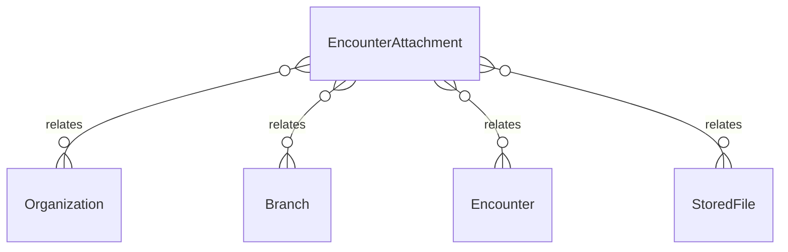

# `EncounterAttachment` → `encounter_attachments`

<!-- generated by .kb/generate.mjs — do not edit by hand -->

Declared at `packages/db/prisma/schema/clinical.prisma:1605`.

| property | value |
| --- | --- |
| table | `encounter_attachments` |
| tenant-scoped | yes — has `organizationId` |
| RLS | **MISSING — this is a tenant-isolation defect** |
| columns | 10 |
| relations | 4 |

## Columns

| column | type | definition |
| --- | --- | --- |
| `id` | `String` | `id String @id @default(uuid()) @db.Uuid` |
| `organizationId` | `String` | `organizationId String @map("organization_id") @db.Uuid` |
| `branchId` | `String` | `branchId String @map("branch_id") @db.Uuid` |
| `encounterId` | `String` | `encounterId String @map("encounter_id") @db.Uuid` |
| `storedFileId` | `String` | `storedFileId String @map("stored_file_id") @db.Uuid` |
| `kind` | `EncounterAttachmentKind` | `kind EncounterAttachmentKind @default(OTHER)` |
| `caption` | `String?` | `caption String? @db.VarChar(500)` |
| `displayOrder` | `Int` | `displayOrder Int @default(0) @map("display_order")` |
| `createdAt` | `DateTime` | `createdAt DateTime @default(now()) @map("created_at") @db.Timestamptz(6)` |
| `updatedAt` | `DateTime` | `updatedAt DateTime @updatedAt @map("updated_at") @db.Timestamptz(6)` |

## Relations

| field | target | definition |
| --- | --- | --- |
| `organization` | [`Organization`](Organization.md) | `organization Organization @relation(fields: [organizationId], references: [id], onDelete: Cascade)` |
| `branch` | [`Branch`](Branch.md) | `branch Branch @relation(fields: [organizationId, branchId], references: [organizationId, id], onDelete: Cascade)` |
| `encounter` | [`Encounter`](Encounter.md) | `encounter Encounter @relation(fields: [organizationId, encounterId], references: [organizationId, id], onDelete: Cascade)` |
| `storedFile` | [`StoredFile`](StoredFile.md) | `storedFile StoredFile? @relation(fields: [organizationId, storedFileId], references: [organizationId, id], onDelete: Restrict, onUpdate: NoAction)` |

## Indexes and constraints

- `@@unique([organizationId, encounterId, storedFileId])`
- `@@index([organizationId, encounterId, displayOrder])`

## Neighbourhood

