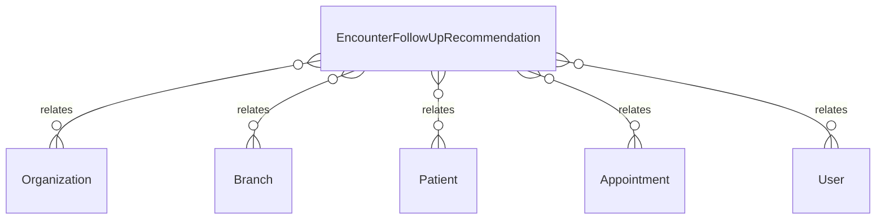

# `EncounterFollowUpRecommendation` → `encounter_follow_up_recommendations`

<!-- generated by .kb/generate.mjs — do not edit by hand -->

Declared at `packages/db/prisma/schema/clinical.prisma:460`.

| property | value |
| --- | --- |
| table | `encounter_follow_up_recommendations` |
| tenant-scoped | yes — has `organizationId` |
| RLS | **MISSING — this is a tenant-isolation defect** |
| columns | 21 |
| relations | 6 |

## Columns

| column | type | definition |
| --- | --- | --- |
| `id` | `String` | `id String @id @default(uuid()) @db.Uuid` |
| `organizationId` | `String` | `organizationId String @map("organization_id") @db.Uuid` |
| `branchId` | `String` | `branchId String @map("branch_id") @db.Uuid` |
| `encounterId` | `String?` | `encounterId String? @map("encounter_id") @db.Uuid` |
| `appointmentId` | `String` | `appointmentId String @map("appointment_id") @db.Uuid` |
| `patientId` | `String` | `patientId String @map("patient_id") @db.Uuid` |
| `isRequired` | `Boolean` | `isRequired Boolean @default(true) @map("is_required")` |
| `intervalValue` | `Int?` | `intervalValue Int? @map("interval_value") @db.SmallInt` |
| `intervalUnit` | `FollowUpIntervalUnit?` | `intervalUnit FollowUpIntervalUnit? @map("interval_unit")` |
| `recommendedDate` | `DateTime?` | `recommendedDate DateTime? @map("recommended_date") @db.Date` |
| `followUpType` | `FollowUpType` | `followUpType FollowUpType @default(ROUTINE) @map("follow_up_type")` |
| `reason` | `String?` | `reason String? @db.Text` |
| `notes` | `String?` | `notes String? @db.Text` |
| `fulfilledByAppointmentId` | `String?` | `fulfilledByAppointmentId String? @map("fulfilled_by_appointment_id") @db.Uuid` |
| `fulfilledAt` | `DateTime?` | `fulfilledAt DateTime? @map("fulfilled_at") @db.Timestamptz(6)` |
| `cancelledAt` | `DateTime?` | `cancelledAt DateTime? @map("cancelled_at") @db.Timestamptz(6)` |
| `cancelledBy` | `String?` | `cancelledBy String? @map("cancelled_by") @db.Uuid` |
| `cancelledReason` | `String?` | `cancelledReason String? @map("cancelled_reason") @db.Text` |
| `createdAt` | `DateTime` | `createdAt DateTime @default(now()) @map("created_at") @db.Timestamptz(6)` |
| `updatedAt` | `DateTime` | `updatedAt DateTime @updatedAt @map("updated_at") @db.Timestamptz(6)` |
| `deletedAt` | `DateTime?` | `deletedAt DateTime? @map("deleted_at") @db.Timestamptz(6)` |

## Relations

| field | target | definition |
| --- | --- | --- |
| `organization` | [`Organization`](Organization.md) | `organization Organization @relation(fields: [organizationId], references: [id], onDelete: Cascade)` |
| `branch` | [`Branch`](Branch.md) | `branch Branch @relation(fields: [organizationId, branchId], references: [organizationId, id], onDelete: Cascade)` |
| `patient` | [`Patient`](Patient.md) | `patient Patient @relation(fields: [organizationId, patientId], references: [organizationId, id], onDelete: Cascade)` |
| `appointment` | [`Appointment`](Appointment.md) | `appointment Appointment @relation("RecommendationSource", fields: [organizationId, appointmentId], references: [organizationId, id], onDelete: Cascade)` |
| `fulfilledBy` | [`Appointment`](Appointment.md) | `fulfilledBy Appointment? @relation("RecommendationFulfilment", fields: [organizationId, fulfilledByAppointmentId], references: [organizationId, id], onDelete: Restrict, onUpdate: NoAction)` |
| `canceller` | [`User`](User.md) | `canceller User? @relation("RecommendationCancelledBy", fields: [cancelledBy], references: [id], onDelete: SetNull)` |

## Indexes and constraints

- `@@index([organizationId, patientId, createdAt])`
- `@@index([organizationId, branchId, recommendedDate])`

## Neighbourhood

