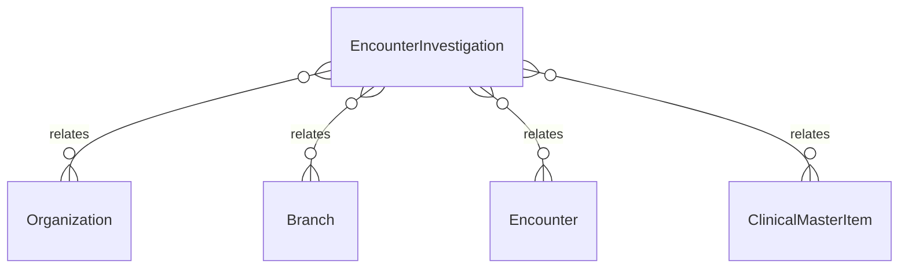

# `EncounterInvestigation` → `encounter_investigations`

<!-- generated by .kb/generate.mjs — do not edit by hand -->

Declared at `packages/db/prisma/schema/clinical.prisma:1487`.

| property | value |
| --- | --- |
| table | `encounter_investigations` |
| tenant-scoped | yes — has `organizationId` |
| RLS | `cites_an_item` policy |
| columns | 12 |
| relations | 4 |

## Columns

| column | type | definition |
| --- | --- | --- |
| `id` | `String` | `id String @id @default(uuid()) @db.Uuid` |
| `organizationId` | `String` | `organizationId String @map("organization_id") @db.Uuid` |
| `branchId` | `String` | `branchId String @map("branch_id") @db.Uuid` |
| `encounterId` | `String` | `encounterId String @map("encounter_id") @db.Uuid` |
| `itemId` | `String?` | `itemId String? @map("item_id") @db.Uuid` |
| `reason` | `String?` | `reason String? @db.Text` |
| `priority` | `InvestigationPriority` | `priority InvestigationPriority @default(ROUTINE)` |
| `instructions` | `String?` | `instructions String? @db.Text` |
| `status` | `InvestigationStatus` | `status InvestigationStatus @default(ORDERED)` |
| `displayOrder` | `Int` | `displayOrder Int @default(0) @map("display_order")` |
| `createdAt` | `DateTime` | `createdAt DateTime @default(now()) @map("created_at") @db.Timestamptz(6)` |
| `updatedAt` | `DateTime` | `updatedAt DateTime @updatedAt @map("updated_at") @db.Timestamptz(6)` |

## Relations

| field | target | definition |
| --- | --- | --- |
| `organization` | [`Organization`](Organization.md) | `organization Organization @relation(fields: [organizationId], references: [id], onDelete: Cascade)` |
| `branch` | [`Branch`](Branch.md) | `branch Branch @relation(fields: [organizationId, branchId], references: [organizationId, id], onDelete: Cascade)` |
| `encounter` | [`Encounter`](Encounter.md) | `encounter Encounter @relation(fields: [organizationId, encounterId], references: [organizationId, id], onDelete: Cascade)` |
| `item` | [`ClinicalMasterItem`](ClinicalMasterItem.md) | `item ClinicalMasterItem? @relation("InvestigationItem", fields: [itemId], references: [id], onDelete: Restrict)` |

## Indexes and constraints

- `@@index([organizationId, encounterId, displayOrder])`
- `@@index([organizationId, status, createdAt])`

## Neighbourhood

