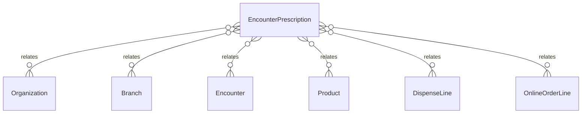

# `EncounterPrescription` → `encounter_prescriptions`

<!-- generated by .kb/generate.mjs — do not edit by hand -->

Declared at `packages/db/prisma/schema/clinical.prisma:1481`.

| property | value |
| --- | --- |
| table | `encounter_prescriptions` |
| tenant-scoped | yes — has `organizationId` |
| RLS | **MISSING — this is a tenant-isolation defect** |
| columns | 26 |
| relations | 6 |

## Columns

| column | type | definition |
| --- | --- | --- |
| `id` | `String` | `id String @id @default(uuid()) @db.Uuid` |
| `organizationId` | `String` | `organizationId String @map("organization_id") @db.Uuid` |
| `branchId` | `String` | `branchId String @map("branch_id") @db.Uuid` |
| `encounterId` | `String` | `encounterId String @map("encounter_id") @db.Uuid` |
| `productId` | `String` | `productId String @map("product_id") @db.Uuid` |
| `strength` | `String?` | `strength String? @db.VarChar(64)` |
| `dose` | `Decimal?` | `dose Decimal? @db.Decimal(10, 3)` |
| `doseUnit` | `String?` | `doseUnit String? @map("dose_unit") @db.VarChar(32)` |
| `route` | `MedicationRoute?` | `route MedicationRoute?` |
| `frequency` | `Int?` | `frequency Int? @db.SmallInt` |
| `frequencyUnit` | `MedicationFrequencyUnit?` | `frequencyUnit MedicationFrequencyUnit? @map("frequency_unit")` |
| `durationValue` | `Int?` | `durationValue Int? @map("duration_value") @db.SmallInt` |
| `durationUnit` | `ClinicalDurationUnit?` | `durationUnit ClinicalDurationUnit? @map("duration_unit")` |
| `foodRelation` | `MedicationFoodRelation?` | `foodRelation MedicationFoodRelation? @map("food_relation")` |
| `timing` | `String?` | `timing String? @db.VarChar(120)` |
| `quantity` | `Decimal?` | `quantity Decimal? @db.Decimal(12, 3)` |
| `startDate` | `DateTime?` | `startDate DateTime? @map("start_date") @db.Date` |
| `endDate` | `DateTime?` | `endDate DateTime? @map("end_date") @db.Date` |
| `repeatsAuthorised` | `Boolean?` | `repeatsAuthorised Boolean? @map("repeats_authorised")` |
| `repeatsAuthorisedLimit` | `Int?` | `repeatsAuthorisedLimit Int? @map("repeats_authorised_limit") @db.SmallInt` |
| `isPrn` | `Boolean` | `isPrn Boolean @default(false) @map("is_prn")` |
| `instructions` | `String?` | `instructions String? @db.Text` |
| `notes` | `String?` | `notes String? @db.Text` |
| `displayOrder` | `Int` | `displayOrder Int @default(0) @map("display_order")` |
| `createdAt` | `DateTime` | `createdAt DateTime @default(now()) @map("created_at") @db.Timestamptz(6)` |
| `updatedAt` | `DateTime` | `updatedAt DateTime @updatedAt @map("updated_at") @db.Timestamptz(6)` |

## Relations

| field | target | definition |
| --- | --- | --- |
| `organization` | [`Organization`](Organization.md) | `organization Organization @relation(fields: [organizationId], references: [id], onDelete: Cascade)` |
| `branch` | [`Branch`](Branch.md) | `branch Branch @relation(fields: [organizationId, branchId], references: [organizationId, id], onDelete: Cascade)` |
| `encounter` | [`Encounter`](Encounter.md) | `encounter Encounter @relation(fields: [organizationId, encounterId], references: [organizationId, id], onDelete: Cascade)` |
| `product` | [`Product`](Product.md) | `product Product @relation(fields: [productId], references: [id], onDelete: Restrict)` |
| `dispenseLines` | [`DispenseLine`](DispenseLine.md) | `dispenseLines DispenseLine[]` |
| `onlineOrderLines` | [`OnlineOrderLine`](OnlineOrderLine.md) | `onlineOrderLines OnlineOrderLine[] @relation("OnlineOrderLinePrescription")` |

## Indexes and constraints

- `@@index([organizationId, encounterId, displayOrder])`
- `@@index([organizationId, productId])`
- `@@index([organizationId, branchId, createdAt])`
- `@@unique([organizationId, id])`

## Neighbourhood

