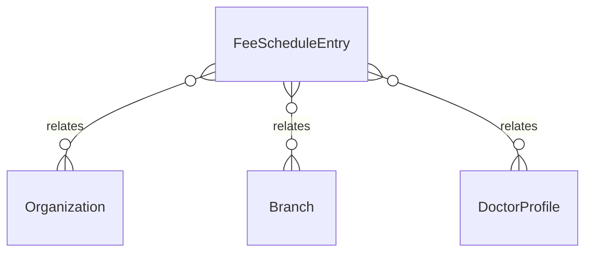

# `FeeScheduleEntry` → `fee_schedule_entries`

<!-- generated by .kb/generate.mjs — do not edit by hand -->

Declared at `packages/db/prisma/schema/doctors.prisma:393`.

| property | value |
| --- | --- |
| table | `fee_schedule_entries` |
| tenant-scoped | yes — has `organizationId` |
| RLS | `org` policy |
| columns | 9 |
| relations | 3 |

## Columns

| column | type | definition |
| --- | --- | --- |
| `id` | `String` | `id String @id @default(uuid()) @db.Uuid` |
| `organizationId` | `String` | `organizationId String @map("organization_id") @db.Uuid` |
| `branchId` | `String?` | `branchId String? @map("branch_id") @db.Uuid` |
| `doctorProfileId` | `String?` | `doctorProfileId String? @map("doctor_profile_id") @db.Uuid` |
| `feeType` | `String` | `feeType String @map("fee_type") @db.VarChar(64)` |
| `amount` | `Decimal` | `amount Decimal @db.Decimal(14, 2)` |
| `createdAt` | `DateTime` | `createdAt DateTime @default(now()) @map("created_at") @db.Timestamptz(6)` |
| `updatedAt` | `DateTime` | `updatedAt DateTime @updatedAt @map("updated_at") @db.Timestamptz(6)` |
| `updatedBy` | `String?` | `updatedBy String? @map("updated_by") @db.Uuid` |

## Relations

| field | target | definition |
| --- | --- | --- |
| `organization` | [`Organization`](Organization.md) | `organization Organization @relation(fields: [organizationId], references: [id], onDelete: Cascade)` |
| `branch` | [`Branch`](Branch.md) | `branch Branch? @relation(fields: [organizationId, branchId], references: [organizationId, id], onDelete: Cascade)` |
| `doctorProfile` | [`DoctorProfile`](DoctorProfile.md) | `doctorProfile DoctorProfile? @relation(fields: [organizationId, doctorProfileId], references: [organizationId, id], onDelete: Cascade)` |

## Indexes and constraints

- `@@unique([organizationId, doctorProfileId, branchId, feeType])`
- `@@index([organizationId, feeType])`

## Neighbourhood

