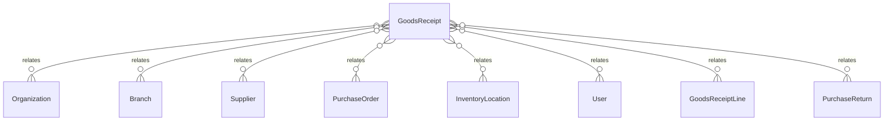

# `GoodsReceipt` → `goods_receipts`

<!-- generated by .kb/generate.mjs — do not edit by hand -->

Declared at `packages/db/prisma/schema/procurement.prisma:799`.

| property | value |
| --- | --- |
| table | `goods_receipts` |
| tenant-scoped | yes — has `organizationId` |
| RLS | `org` policy |
| columns | 29 |
| relations | 10 |

## Columns

| column | type | definition |
| --- | --- | --- |
| `id` | `String` | `id String @id @default(uuid()) @db.Uuid` |
| `organizationId` | `String` | `organizationId String @map("organization_id") @db.Uuid` |
| `branchId` | `String` | `branchId String @map("branch_id") @db.Uuid` |
| `receiptNumber` | `String?` | `receiptNumber String? @map("receipt_number") @db.VarChar(64)` |
| `supplierId` | `String` | `supplierId String @map("supplier_id") @db.Uuid` |
| `purchaseOrderId` | `String?` | `purchaseOrderId String? @map("purchase_order_id") @db.Uuid` |
| `status` | `GoodsReceiptStatus` | `status GoodsReceiptStatus @default(DRAFT)` |
| `supplierName` | `String` | `supplierName String @map("supplier_name") @db.VarChar(255)` |
| `supplierInvoiceNumber` | `String?` | `supplierInvoiceNumber String? @map("supplier_invoice_number") @db.VarChar(64)` |
| `supplierInvoiceDate` | `DateTime?` | `supplierInvoiceDate DateTime? @map("supplier_invoice_date") @db.Date` |
| `locationId` | `String` | `locationId String @map("location_id") @db.Uuid` |
| `receivedAt` | `DateTime` | `receivedAt DateTime @default(now()) @map("received_at") @db.Timestamptz(6)` |
| `currency` | `String` | `currency String @db.Char(3)` |
| `freightMinor` | `BigInt` | `freightMinor BigInt @default(0) @map("freight_minor") @db.BigInt` |
| `dutyMinor` | `BigInt` | `dutyMinor BigInt @default(0) @map("duty_minor") @db.BigInt` |
| `handlingMinor` | `BigInt` | `handlingMinor BigInt @default(0) @map("handling_minor") @db.BigInt` |
| `goodsValueMinor` | `BigInt` | `goodsValueMinor BigInt @default(0) @map("goods_value_minor") @db.BigInt` |
| `taxAmountMinor` | `BigInt` | `taxAmountMinor BigInt @default(0) @map("tax_amount_minor") @db.BigInt` |
| `totalMinor` | `BigInt` | `totalMinor BigInt @default(0) @map("total_minor") @db.BigInt` |
| `qualityHoldRequired` | `Boolean` | `qualityHoldRequired Boolean @default(false) @map("quality_hold_required")` |
| `notes` | `String?` | `notes String? @db.Text` |
| `createdById` | `String` | `createdById String @map("created_by_id") @db.Uuid` |
| `postedAt` | `DateTime?` | `postedAt DateTime? @map("posted_at") @db.Timestamptz(6)` |
| `postedById` | `String?` | `postedById String? @map("posted_by_id") @db.Uuid` |
| `cancelledAt` | `DateTime?` | `cancelledAt DateTime? @map("cancelled_at") @db.Timestamptz(6)` |
| `cancelledById` | `String?` | `cancelledById String? @map("cancelled_by_id") @db.Uuid` |
| `cancellationReason` | `String?` | `cancellationReason String? @map("cancellation_reason") @db.Text` |
| `createdAt` | `DateTime` | `createdAt DateTime @default(now()) @map("created_at") @db.Timestamptz(6)` |
| `updatedAt` | `DateTime` | `updatedAt DateTime @updatedAt @map("updated_at") @db.Timestamptz(6)` |

## Relations

| field | target | definition |
| --- | --- | --- |
| `organization` | [`Organization`](Organization.md) | `organization Organization @relation(fields: [organizationId], references: [id], onDelete: Cascade)` |
| `branch` | [`Branch`](Branch.md) | `branch Branch @relation(fields: [organizationId, branchId], references: [organizationId, id], onDelete: Cascade)` |
| `supplier` | [`Supplier`](Supplier.md) | `supplier Supplier @relation(fields: [organizationId, supplierId], references: [organizationId, id], onDelete: Restrict)` |
| `purchaseOrder` | [`PurchaseOrder`](PurchaseOrder.md) | `purchaseOrder PurchaseOrder? @relation(fields: [organizationId, purchaseOrderId], references: [organizationId, id], onDelete: Restrict)` |
| `location` | [`InventoryLocation`](InventoryLocation.md) | `location InventoryLocation @relation("GoodsReceiptLocation", fields: [organizationId, branchId, locationId], references: [organizationId, branchId, id], onDelete: Restrict)` |
| `createdBy` | [`User`](User.md) | `createdBy User @relation("GoodsReceiptCreatedBy", fields: [createdById], references: [id], onDelete: Restrict)` |
| `postedBy` | [`User`](User.md) | `postedBy User? @relation("GoodsReceiptPostedBy", fields: [postedById], references: [id], onDelete: Restrict)` |
| `cancelledBy` | [`User`](User.md) | `cancelledBy User? @relation("GoodsReceiptCancelledBy", fields: [cancelledById], references: [id], onDelete: Restrict)` |
| `lines` | [`GoodsReceiptLine`](GoodsReceiptLine.md) | `lines GoodsReceiptLine[]` |
| `returns` | [`PurchaseReturn`](PurchaseReturn.md) | `returns PurchaseReturn[]` |

## Indexes and constraints

- `@@unique([organizationId, receiptNumber])`
- `@@unique([organizationId, id])`
- `@@unique([organizationId, branchId, id])`
- `@@index([organizationId, branchId, status, receivedAt(sort: Desc)])`
- `@@index([organizationId, supplierId, receivedAt(sort: Desc)])`
- `@@index([organizationId, purchaseOrderId])`

## Neighbourhood

