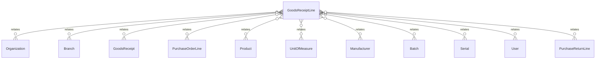

# `GoodsReceiptLine` → `goods_receipt_lines`

<!-- generated by .kb/generate.mjs — do not edit by hand -->

Declared at `packages/db/prisma/schema/procurement.prisma:904`.

| property | value |
| --- | --- |
| table | `goods_receipt_lines` |
| tenant-scoped | yes — has `organizationId` |
| RLS | `branch` policy |
| columns | 33 |
| relations | 11 |

## Columns

| column | type | definition |
| --- | --- | --- |
| `id` | `String` | `id String @id @default(uuid()) @db.Uuid` |
| `organizationId` | `String` | `organizationId String @map("organization_id") @db.Uuid` |
| `branchId` | `String` | `branchId String @map("branch_id") @db.Uuid` |
| `goodsReceiptId` | `String` | `goodsReceiptId String @map("goods_receipt_id") @db.Uuid` |
| `lineNumber` | `Int` | `lineNumber Int @map("line_number") @db.SmallInt` |
| `purchaseOrderLineId` | `String?` | `purchaseOrderLineId String? @map("purchase_order_line_id") @db.Uuid` |
| `productId` | `String` | `productId String @map("product_id") @db.Uuid` |
| `batchId` | `String?` | `batchId String? @map("batch_id") @db.Uuid` |
| `serialId` | `String?` | `serialId String? @map("serial_id") @db.Uuid` |
| `receivedQuantityBase` | `Decimal` | `receivedQuantityBase Decimal @map("received_quantity_base") @db.Decimal(18, 6)` |
| `quantityEntered` | `Decimal` | `quantityEntered Decimal @map("quantity_entered") @db.Decimal(18, 6)` |
| `unitId` | `String` | `unitId String @map("unit_id") @db.Uuid` |
| `rejectedQuantityBase` | `Decimal` | `rejectedQuantityBase Decimal @default(0) @map("rejected_quantity_base") @db.Decimal(18, 6)` |
| `lotNumber` | `String?` | `lotNumber String? @map("lot_number") @db.VarChar(128)` |
| `manufacturedOn` | `DateTime?` | `manufacturedOn DateTime? @map("manufactured_on") @db.Date` |
| `expiresOn` | `DateTime?` | `expiresOn DateTime? @map("expires_on") @db.Date` |
| `retestOn` | `DateTime?` | `retestOn DateTime? @map("retest_on") @db.Date` |
| `manufacturerId` | `String?` | `manufacturerId String? @map("manufacturer_id") @db.Uuid` |
| `serialNumber` | `String?` | `serialNumber String? @map("serial_number") @db.VarChar(128)` |
| `unitCostBase` | `BigInt` | `unitCostBase BigInt @map("unit_cost_base") @db.BigInt` |
| `currency` | `String` | `currency String @db.Char(3)` |
| `landedCostMinor` | `BigInt` | `landedCostMinor BigInt @default(0) @map("landed_cost_minor") @db.BigInt` |
| `lineSubtotalMinor` | `BigInt` | `lineSubtotalMinor BigInt @default(0) @map("line_subtotal_minor") @db.BigInt` |
| `taxRateBps` | `Int?` | `taxRateBps Int? @map("tax_rate_bps")` |
| `taxAmountMinor` | `BigInt` | `taxAmountMinor BigInt @default(0) @map("tax_amount_minor") @db.BigInt` |
| `lineTotalMinor` | `BigInt` | `lineTotalMinor BigInt @default(0) @map("line_total_minor") @db.BigInt` |
| `qualityStatus` | `GoodsReceiptQualityStatus` | `qualityStatus GoodsReceiptQualityStatus @default(NOT_REQUIRED) @map("quality_status")` |
| `qualityDecidedAt` | `DateTime?` | `qualityDecidedAt DateTime? @map("quality_decided_at") @db.Timestamptz(6)` |
| `qualityDecidedById` | `String?` | `qualityDecidedById String? @map("quality_decided_by_id") @db.Uuid` |
| `qualityNotes` | `String?` | `qualityNotes String? @map("quality_notes") @db.Text` |
| `notes` | `String?` | `notes String? @db.Text` |
| `createdAt` | `DateTime` | `createdAt DateTime @default(now()) @map("created_at") @db.Timestamptz(6)` |
| `updatedAt` | `DateTime` | `updatedAt DateTime @updatedAt @map("updated_at") @db.Timestamptz(6)` |

## Relations

| field | target | definition |
| --- | --- | --- |
| `organization` | [`Organization`](Organization.md) | `organization Organization @relation(fields: [organizationId], references: [id], onDelete: Cascade)` |
| `branch` | [`Branch`](Branch.md) | `branch Branch @relation(fields: [organizationId, branchId], references: [organizationId, id], onDelete: Cascade)` |
| `goodsReceipt` | [`GoodsReceipt`](GoodsReceipt.md) | `goodsReceipt GoodsReceipt @relation(fields: [organizationId, goodsReceiptId], references: [organizationId, id], onDelete: Cascade)` |
| `purchaseOrderLine` | [`PurchaseOrderLine`](PurchaseOrderLine.md) | `purchaseOrderLine PurchaseOrderLine? @relation(fields: [organizationId, purchaseOrderLineId], references: [organizationId, id], onDelete: Restrict)` |
| `product` | [`Product`](Product.md) | `product Product @relation(fields: [productId], references: [id], onDelete: Restrict)` |
| `unit` | [`UnitOfMeasure`](UnitOfMeasure.md) | `unit UnitOfMeasure @relation("GoodsReceiptLineUnit", fields: [unitId], references: [id], onDelete: Restrict)` |
| `manufacturer` | [`Manufacturer`](Manufacturer.md) | `manufacturer Manufacturer? @relation("GoodsReceiptLineManufacturer", fields: [manufacturerId], references: [id], onDelete: Restrict)` |
| `batch` | [`Batch`](Batch.md) | `batch Batch? @relation("GoodsReceiptLineBatch", fields: [organizationId, branchId, batchId], references: [organizationId, branchId, id], onDelete: Restrict)` |
| `serial` | [`Serial`](Serial.md) | `serial Serial? @relation("GoodsReceiptLineSerial", fields: [organizationId, branchId, serialId], references: [organizationId, branchId, id], onDelete: Restrict)` |
| `qualityDecidedBy` | [`User`](User.md) | `qualityDecidedBy User? @relation("GoodsReceiptLineQualityDecidedBy", fields: [qualityDecidedById], references: [id], onDelete: Restrict)` |
| `returnLines` | [`PurchaseReturnLine`](PurchaseReturnLine.md) | `returnLines PurchaseReturnLine[]` |

## Indexes and constraints

- `@@unique([organizationId, goodsReceiptId, productId, lotNumber, serialNumber])`
- `@@unique([organizationId, goodsReceiptId, lineNumber])`
- `@@unique([organizationId, id])`
- `@@index([organizationId, goodsReceiptId])`
- `@@index([organizationId, productId])`
- `@@index([organizationId, purchaseOrderLineId])`
- `@@index([organizationId, branchId, qualityStatus])`

## Neighbourhood

