# `InventoryLocation` → `inventory_locations`

<!-- generated by .kb/generate.mjs — do not edit by hand -->

Declared at `packages/db/prisma/schema/inventory.prisma:252`.

| property | value |
| --- | --- |
| table | `inventory_locations` |
| tenant-scoped | yes — has `organizationId` |
| RLS | `visible` policy |
| columns | 13 |
| relations | 19 |

## Columns

| column | type | definition |
| --- | --- | --- |
| `id` | `String` | `id String @id @default(uuid()) @db.Uuid` |
| `organizationId` | `String` | `organizationId String @map("organization_id") @db.Uuid` |
| `branchId` | `String` | `branchId String @map("branch_id") @db.Uuid` |
| `kind` | `LocationKind` | `kind LocationKind` |
| `code` | `String` | `code String @db.VarChar(64)` |
| `name` | `String` | `name String @db.VarChar(255)` |
| `isDispensingPoint` | `Boolean` | `isDispensingPoint Boolean @default(false) @map("is_dispensing_point")` |
| `requiresControlledAccess` | `Boolean` | `requiresControlledAccess Boolean @default(false) @map("requires_controlled_access")` |
| `storageProfileId` | `String?` | `storageProfileId String? @map("storage_profile_id") @db.Uuid` |
| `isActive` | `Boolean` | `isActive Boolean @default(true) @map("is_active")` |
| `createdAt` | `DateTime` | `createdAt DateTime @default(now()) @map("created_at") @db.Timestamptz(6)` |
| `updatedAt` | `DateTime` | `updatedAt DateTime @updatedAt @map("updated_at") @db.Timestamptz(6)` |
| `deletedAt` | `DateTime?` | `deletedAt DateTime? @map("deleted_at") @db.Timestamptz(6)` |

## Relations

| field | target | definition |
| --- | --- | --- |
| `organization` | [`Organization`](Organization.md) | `organization Organization @relation(fields: [organizationId], references: [id], onDelete: Cascade)` |
| `branch` | [`Branch`](Branch.md) | `branch Branch @relation(fields: [organizationId, branchId], references: [organizationId, id], onDelete: Cascade)` |
| `storageProfile` | [`StorageRequirementProfile`](StorageRequirementProfile.md) | `storageProfile StorageRequirementProfile? @relation(fields: [storageProfileId], references: [id], onDelete: Restrict)` |
| `areas` | [`StorageArea`](StorageArea.md) | `areas StorageArea[]` |
| `serialsHere` | [`Serial`](Serial.md) | `serialsHere Serial[]` |
| `balances` | [`StockBalance`](StockBalance.md) | `balances StockBalance[]` |
| `movementsFrom` | [`StockLedgerEntry`](StockLedgerEntry.md) | `movementsFrom StockLedgerEntry[] @relation("MovementFromLocation")` |
| `movementsTo` | [`StockLedgerEntry`](StockLedgerEntry.md) | `movementsTo StockLedgerEntry[] @relation("MovementToLocation")` |
| `transfersFrom` | [`StockTransfer`](StockTransfer.md) | `transfersFrom StockTransfer[] @relation("TransferFromLocation")` |
| `transfersTo` | [`StockTransfer`](StockTransfer.md) | `transfersTo StockTransfer[] @relation("TransferToLocation")` |
| `reservations` | [`StockReservation`](StockReservation.md) | `reservations StockReservation[]` |
| `purchaseOrderDeliveries` | [`PurchaseOrder`](PurchaseOrder.md) | `purchaseOrderDeliveries PurchaseOrder[] @relation("PurchaseOrderDeliverTo")` |
| `goodsReceipts` | [`GoodsReceipt`](GoodsReceipt.md) | `goodsReceipts GoodsReceipt[] @relation("GoodsReceiptLocation")` |
| `purchaseReturns` | [`PurchaseReturn`](PurchaseReturn.md) | `purchaseReturns PurchaseReturn[] @relation("PurchaseReturnLocation")` |
| `dispenses` | [`Dispense`](Dispense.md) | `dispenses Dispense[] @relation("DispenseLocation")` |
| `dispenseAllocations` | [`DispenseAllocation`](DispenseAllocation.md) | `dispenseAllocations DispenseAllocation[] @relation("DispenseAllocationLocation")` |
| `dispenseReturns` | [`DispenseReturn`](DispenseReturn.md) | `dispenseReturns DispenseReturn[] @relation("DispenseReturnLocation")` |
| `consumptions` | [`ClinicalConsumption`](ClinicalConsumption.md) | `consumptions ClinicalConsumption[] @relation("ConsumptionLocation")` |
| `consumptionAllocations` | [`ConsumptionAllocation`](ConsumptionAllocation.md) | `consumptionAllocations ConsumptionAllocation[] @relation("ConsumptionAllocationLocation")` |

## Indexes and constraints

- `@@unique([organizationId, branchId, code])`
- `@@unique([organizationId, id])`
- `@@unique([organizationId, branchId, id])`
- `@@index([organizationId, branchId, isActive])`
- `@@index([organizationId, branchId, kind])`

## Neighbourhood

```mermaid
erDiagram
    InventoryLocation }o--o{ Organization : relates
    InventoryLocation }o--o{ Branch : relates
    InventoryLocation }o--o{ StorageRequirementProfile : relates
    InventoryLocation }o--o{ StorageArea : relates
    InventoryLocation }o--o{ Serial : relates
    InventoryLocation }o--o{ StockBalance : relates
    InventoryLocation }o--o{ StockLedgerEntry : relates
    InventoryLocation }o--o{ StockTransfer : relates
    InventoryLocation }o--o{ StockReservation : relates
    InventoryLocation }o--o{ PurchaseOrder : relates
    InventoryLocation }o--o{ GoodsReceipt : relates
    InventoryLocation }o--o{ PurchaseReturn : relates
    InventoryLocation }o--o{ Dispense : relates
    InventoryLocation }o--o{ DispenseAllocation : relates
    InventoryLocation }o--o{ DispenseReturn : relates
    InventoryLocation }o--o{ ClinicalConsumption : relates
    InventoryLocation }o--o{ ConsumptionAllocation : relates
```

