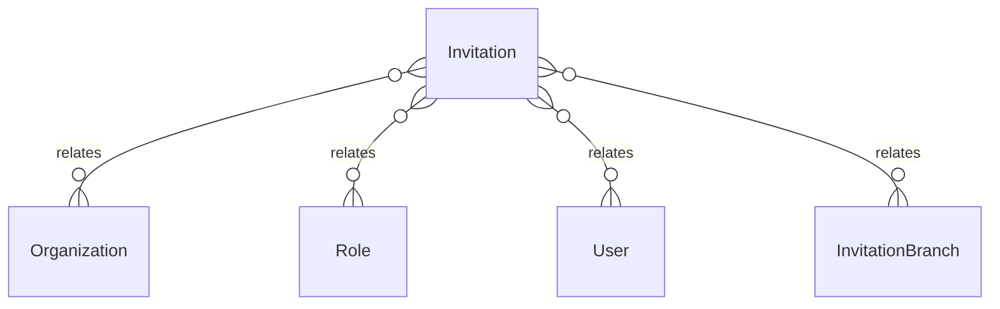

# `Invitation` → `invitations`

<!-- generated by .kb/generate.mjs — do not edit by hand -->

Declared at `packages/db/prisma/schema.prisma:675`.

| property | value |
| --- | --- |
| table | `invitations` |
| tenant-scoped | yes — has `organizationId` |
| RLS | `org` policy |
| columns | 11 |
| relations | 4 |

## Columns

| column | type | definition |
| --- | --- | --- |
| `id` | `String` | `id String @id @default(uuid()) @db.Uuid` |
| `organizationId` | `String` | `organizationId String @map("organization_id") @db.Uuid` |
| `email` | `String` | `email String @db.VarChar(255)` |
| `phone` | `String?` | `phone String? @db.VarChar(20)` |
| `roleId` | `String` | `roleId String @map("role_id") @db.Uuid` |
| `token` | `String` | `token String @unique @db.VarChar(255)` |
| `invitedBy` | `String` | `invitedBy String @map("invited_by") @db.Uuid` |
| `expiresAt` | `DateTime` | `expiresAt DateTime @map("expires_at") @db.Timestamptz(6)` |
| `acceptedAt` | `DateTime?` | `acceptedAt DateTime? @map("accepted_at") @db.Timestamptz(6)` |
| `revokedAt` | `DateTime?` | `revokedAt DateTime? @map("revoked_at") @db.Timestamptz(6)` |
| `createdAt` | `DateTime` | `createdAt DateTime @default(now()) @map("created_at") @db.Timestamptz(6)` |

## Relations

| field | target | definition |
| --- | --- | --- |
| `organization` | [`Organization`](Organization.md) | `organization Organization @relation(fields: [organizationId], references: [id], onDelete: Cascade)` |
| `role` | [`Role`](Role.md) | `role Role @relation(fields: [roleId], references: [id], onDelete: Cascade)` |
| `inviter` | [`User`](User.md) | `inviter User @relation("InvitedBy", fields: [invitedBy], references: [id])` |
| `branches` | [`InvitationBranch`](InvitationBranch.md) | `branches InvitationBranch[]` |

## Indexes and constraints

- `@@index([organizationId, email])`

## Neighbourhood

