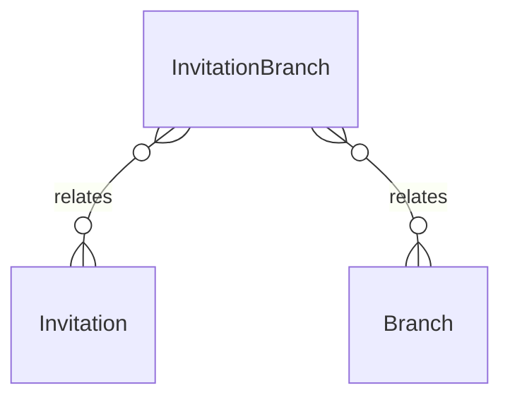

# `InvitationBranch` → `invitation_branches`

<!-- generated by .kb/generate.mjs — do not edit by hand -->

Declared at `packages/db/prisma/schema/access-control.prisma:204`.

| property | value |
| --- | --- |
| table | `invitation_branches` |
| tenant-scoped | no |
| RLS | `parent` policy |
| columns | 3 |
| relations | 2 |

## Columns

| column | type | definition |
| --- | --- | --- |
| `id` | `String` | `id String @id @default(uuid()) @db.Uuid` |
| `invitationId` | `String` | `invitationId String @map("invitation_id") @db.Uuid` |
| `branchId` | `String` | `branchId String @map("branch_id") @db.Uuid` |

## Relations

| field | target | definition |
| --- | --- | --- |
| `invitation` | [`Invitation`](Invitation.md) | `invitation Invitation @relation(fields: [invitationId], references: [id], onDelete: Cascade)` |
| `branch` | [`Branch`](Branch.md) | `branch Branch @relation(fields: [branchId], references: [id], onDelete: Cascade)` |

## Indexes and constraints

- `@@unique([invitationId, branchId])`

## Neighbourhood

