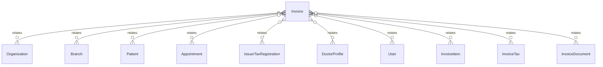

# `Invoice` → `invoices`

<!-- generated by .kb/generate.mjs — do not edit by hand -->

Declared at `packages/db/prisma/schema/invoicing.prisma:149`.

| property | value |
| --- | --- |
| table | `invoices` |
| tenant-scoped | yes — has `organizationId` |
| RLS | **MISSING — this is a tenant-isolation defect** |
| columns | 46 |
| relations | 12 |

## Columns

| column | type | definition |
| --- | --- | --- |
| `id` | `String` | `id String @id @default(uuid()) @db.Uuid` |
| `organizationId` | `String` | `organizationId String @map("organization_id") @db.Uuid` |
| `branchId` | `String` | `branchId String @map("branch_id") @db.Uuid` |
| `invoiceNumber` | `String?` | `invoiceNumber String? @map("invoice_number") @db.VarChar(64)` |
| `sourceType` | `InvoiceSourceType` | `sourceType InvoiceSourceType @map("source_type")` |
| `appointmentId` | `String?` | `appointmentId String? @map("appointment_id") @db.Uuid` |
| `patientId` | `String?` | `patientId String? @map("patient_id") @db.Uuid` |
| `customerName` | `String` | `customerName String @map("customer_name") @db.VarChar(255)` |
| `customerPhone` | `String?` | `customerPhone String? @map("customer_phone") @db.VarChar(20)` |
| `customerEmail` | `String?` | `customerEmail String? @map("customer_email") @db.VarChar(255)` |
| `customerAddress` | `String?` | `customerAddress String? @map("customer_address") @db.Text` |
| `customerTaxId` | `String?` | `customerTaxId String? @map("customer_tax_id") @db.VarChar(32)` |
| `practitionerName` | `String?` | `practitionerName String? @map("practitioner_name") @db.VarChar(255)` |
| `practitionerRegistrationNumber` | `String?` | `practitionerRegistrationNumber String? @map("practitioner_registration_number") @db.VarChar(64)` |
| `practitionerProfileId` | `String?` | `practitionerProfileId String? @map("practitioner_profile_id") @db.Uuid` |
| `suppliedAt` | `DateTime` | `suppliedAt DateTime @map("supplied_at") @db.Timestamptz(6)` |
| `issuedAt` | `DateTime?` | `issuedAt DateTime? @map("issued_at") @db.Timestamptz(6)` |
| `dueDate` | `DateTime?` | `dueDate DateTime? @map("due_date") @db.Date` |
| `issuerTaxRegistrationId` | `String?` | `issuerTaxRegistrationId String? @map("issuer_tax_registration_id") @db.Uuid` |
| `issuerTaxId` | `String?` | `issuerTaxId String? @map("issuer_tax_id") @db.VarChar(64)` |
| `issuerLegalName` | `String?` | `issuerLegalName String? @map("issuer_legal_name") @db.VarChar(255)` |
| `placeOfSupply` | `String?` | `placeOfSupply String? @map("place_of_supply") @db.VarChar(10)` |
| `taxTreatment` | `TaxTreatment` | `taxTreatment TaxTreatment @default(NOT_REGISTERED) @map("tax_treatment")` |
| `currency` | `String` | `currency String @default("INR") @db.Char(3)` |
| `subtotal` | `Decimal` | `subtotal Decimal @default(0) @db.Decimal(14, 2)` |
| `lineDiscountTotal` | `Decimal` | `lineDiscountTotal Decimal @default(0) @map("line_discount_total") @db.Decimal(14, 2)` |
| `discountType` | `InvoiceDiscountType?` | `discountType InvoiceDiscountType? @map("discount_type")` |
| `discountBps` | `Int?` | `discountBps Int? @map("discount_bps")` |
| `discountFixed` | `Decimal?` | `discountFixed Decimal? @map("discount_fixed") @db.Decimal(14, 2)` |
| `invoiceDiscountTotal` | `Decimal` | `invoiceDiscountTotal Decimal @default(0) @map("invoice_discount_total") @db.Decimal(14, 2)` |
| `taxableAmount` | `Decimal` | `taxableAmount Decimal @default(0) @map("taxable_amount") @db.Decimal(14, 2)` |
| `taxTotal` | `Decimal` | `taxTotal Decimal @default(0) @map("tax_total") @db.Decimal(14, 2)` |
| `roundingAdjustment` | `Decimal` | `roundingAdjustment Decimal @default(0) @map("rounding_adjustment") @db.Decimal(14, 2)` |
| `grandTotal` | `Decimal` | `grandTotal Decimal @default(0) @map("grand_total") @db.Decimal(14, 2)` |
| `amountPaid` | `Decimal` | `amountPaid Decimal @default(0) @map("amount_paid") @db.Decimal(14, 2)` |
| `status` | `InvoiceStatus` | `status InvoiceStatus @default(DRAFT)` |
| `notes` | `String?` | `notes String? @db.Text` |
| `cancellationReason` | `String?` | `cancellationReason String? @map("cancellation_reason") @db.Text` |
| `createdBy` | `String?` | `createdBy String? @map("created_by") @db.Uuid` |
| `issuedBy` | `String?` | `issuedBy String? @map("issued_by") @db.Uuid` |
| `cancelledBy` | `String?` | `cancelledBy String? @map("cancelled_by") @db.Uuid` |
| `cancelledAt` | `DateTime?` | `cancelledAt DateTime? @map("cancelled_at") @db.Timestamptz(6)` |
| `voidedAt` | `DateTime?` | `voidedAt DateTime? @map("voided_at") @db.Timestamptz(6)` |
| `createdAt` | `DateTime` | `createdAt DateTime @default(now()) @map("created_at") @db.Timestamptz(6)` |
| `updatedAt` | `DateTime` | `updatedAt DateTime @updatedAt @map("updated_at") @db.Timestamptz(6)` |
| `deletedAt` | `DateTime?` | `deletedAt DateTime? @map("deleted_at") @db.Timestamptz(6)` |

## Relations

| field | target | definition |
| --- | --- | --- |
| `organization` | [`Organization`](Organization.md) | `organization Organization @relation(fields: [organizationId], references: [id], onDelete: Cascade)` |
| `branch` | [`Branch`](Branch.md) | `branch Branch @relation(fields: [organizationId, branchId], references: [organizationId, id], onDelete: Cascade)` |
| `patient` | [`Patient`](Patient.md) | `patient Patient? @relation(fields: [organizationId, patientId], references: [organizationId, id], onDelete: Restrict)` |
| `appointment` | [`Appointment`](Appointment.md) | `appointment Appointment? @relation(fields: [organizationId, appointmentId], references: [organizationId, id], onDelete: Restrict, onUpdate: NoAction)` |
| `issuerRegistration` | [`IssuerTaxRegistration`](IssuerTaxRegistration.md) | `issuerRegistration IssuerTaxRegistration? @relation(fields: [organizationId, issuerTaxRegistrationId], references: [organizationId, id], onDelete: Restrict, onUpdate: NoAction)` |
| `practitioner` | [`DoctorProfile`](DoctorProfile.md) | `practitioner DoctorProfile? @relation("InvoicePractitioner", fields: [organizationId, practitionerProfileId], references: [organizationId, id], onDelete: Restrict, onUpdate: NoAction)` |
| `creator` | [`User`](User.md) | `creator User? @relation("InvoiceCreatedBy", fields: [createdBy], references: [id], onDelete: SetNull)` |
| `issuer` | [`User`](User.md) | `issuer User? @relation("InvoiceIssuedBy", fields: [issuedBy], references: [id], onDelete: SetNull)` |
| `canceller` | [`User`](User.md) | `canceller User? @relation("InvoiceCancelledBy", fields: [cancelledBy], references: [id], onDelete: SetNull)` |
| `items` | [`InvoiceItem`](InvoiceItem.md) | `items InvoiceItem[]` |
| `taxes` | [`InvoiceTax`](InvoiceTax.md) | `taxes InvoiceTax[]` |
| `documents` | [`InvoiceDocument`](InvoiceDocument.md) | `documents InvoiceDocument[]` |

## Indexes and constraints

- `@@unique([organizationId, invoiceNumber])`
- `@@unique([organizationId, id])`
- `@@index([organizationId, branchId, status, createdAt])`
- `@@index([organizationId, patientId, createdAt])`
- `@@index([organizationId, appointmentId])`
- `@@index([organizationId, practitionerProfileId])`

## Neighbourhood

