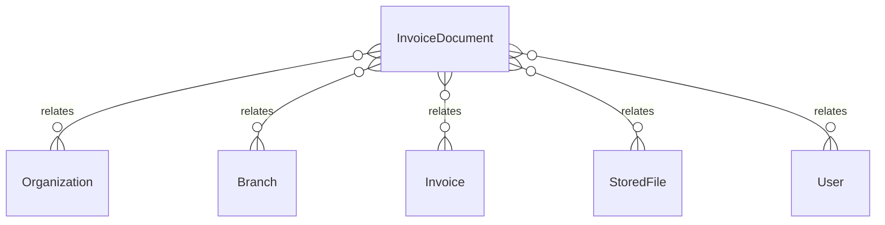

# `InvoiceDocument` → `invoice_documents`

<!-- generated by .kb/generate.mjs — do not edit by hand -->

Declared at `packages/db/prisma/schema/invoicing.prisma:548`.

| property | value |
| --- | --- |
| table | `invoice_documents` |
| tenant-scoped | yes — has `organizationId` |
| RLS | **MISSING — this is a tenant-isolation defect** |
| columns | 12 |
| relations | 5 |

## Columns

| column | type | definition |
| --- | --- | --- |
| `id` | `String` | `id String @id @default(uuid()) @db.Uuid` |
| `organizationId` | `String` | `organizationId String @map("organization_id") @db.Uuid` |
| `branchId` | `String` | `branchId String @map("branch_id") @db.Uuid` |
| `invoiceId` | `String` | `invoiceId String @map("invoice_id") @db.Uuid` |
| `fileId` | `String` | `fileId String @map("file_id") @db.Uuid` |
| `documentType` | `DocumentType` | `documentType DocumentType @map("document_type")` |
| `templateKey` | `String` | `templateKey String @map("template_key") @db.VarChar(64)` |
| `templateVersion` | `Int` | `templateVersion Int @map("template_version") @db.SmallInt` |
| `generatedAt` | `DateTime` | `generatedAt DateTime @default(now()) @map("generated_at") @db.Timestamptz(6)` |
| `generatedBy` | `String?` | `generatedBy String? @map("generated_by") @db.Uuid` |
| `supersededAt` | `DateTime?` | `supersededAt DateTime? @map("superseded_at") @db.Timestamptz(6)` |
| `createdAt` | `DateTime` | `createdAt DateTime @default(now()) @map("created_at") @db.Timestamptz(6)` |

## Relations

| field | target | definition |
| --- | --- | --- |
| `organization` | [`Organization`](Organization.md) | `organization Organization @relation(fields: [organizationId], references: [id], onDelete: Cascade)` |
| `branch` | [`Branch`](Branch.md) | `branch Branch @relation(fields: [organizationId, branchId], references: [organizationId, id], onDelete: Cascade)` |
| `invoice` | [`Invoice`](Invoice.md) | `invoice Invoice @relation(fields: [organizationId, invoiceId], references: [organizationId, id], onDelete: Cascade)` |
| `file` | [`StoredFile`](StoredFile.md) | `file StoredFile @relation(fields: [fileId], references: [id], onDelete: Restrict)` |
| `generator` | [`User`](User.md) | `generator User? @relation("InvoiceDocumentGeneratedBy", fields: [generatedBy], references: [id], onDelete: SetNull)` |

## Indexes and constraints

- `@@index([organizationId, invoiceId])`
- `@@index([organizationId, fileId])`

## Neighbourhood

