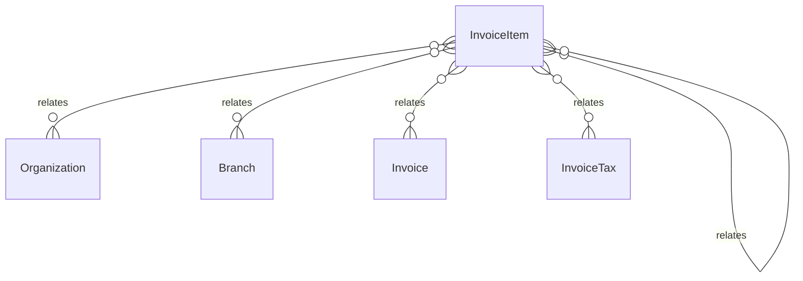

# `InvoiceItem` → `invoice_items`

<!-- generated by .kb/generate.mjs — do not edit by hand -->

Declared at `packages/db/prisma/schema/invoicing.prisma:468`.

| property | value |
| --- | --- |
| table | `invoice_items` |
| tenant-scoped | yes — has `organizationId` |
| RLS | **MISSING — this is a tenant-isolation defect** |
| columns | 24 |
| relations | 6 |

## Columns

| column | type | definition |
| --- | --- | --- |
| `id` | `String` | `id String @id @default(uuid()) @db.Uuid` |
| `organizationId` | `String` | `organizationId String @map("organization_id") @db.Uuid` |
| `branchId` | `String` | `branchId String @map("branch_id") @db.Uuid` |
| `invoiceId` | `String` | `invoiceId String @map("invoice_id") @db.Uuid` |
| `lineNumber` | `Int` | `lineNumber Int @map("line_number") @db.SmallInt` |
| `description` | `String` | `description String @db.VarChar(255)` |
| `itemCode` | `String?` | `itemCode String? @map("item_code") @db.VarChar(32)` |
| `creditedInvoiceItemId` | `String?` | `creditedInvoiceItemId String? @map("credited_invoice_item_id") @db.Uuid` |
| `taxCategory` | `String` | `taxCategory String @map("tax_category") @db.VarChar(64)` |
| `quantity` | `Decimal` | `quantity Decimal @default(1) @db.Decimal(14, 3)` |
| `unitPrice` | `Decimal` | `unitPrice Decimal @map("unit_price") @db.Decimal(14, 2)` |
| `grossAmount` | `Decimal` | `grossAmount Decimal @map("gross_amount") @db.Decimal(14, 2)` |
| `discountType` | `InvoiceDiscountType?` | `discountType InvoiceDiscountType? @map("discount_type")` |
| `discountBps` | `Int?` | `discountBps Int? @map("discount_bps")` |
| `discountFixed` | `Decimal?` | `discountFixed Decimal? @map("discount_fixed") @db.Decimal(14, 2)` |
| `discountAmount` | `Decimal` | `discountAmount Decimal @default(0) @map("discount_amount") @db.Decimal(14, 2)` |
| `apportionedDiscount` | `Decimal` | `apportionedDiscount Decimal @default(0) @map("apportioned_discount") @db.Decimal(14, 2)` |
| `taxableAmount` | `Decimal` | `taxableAmount Decimal @map("taxable_amount") @db.Decimal(14, 2)` |
| `taxAmount` | `Decimal` | `taxAmount Decimal @default(0) @map("tax_amount") @db.Decimal(14, 2)` |
| `lineTotal` | `Decimal` | `lineTotal Decimal @map("line_total") @db.Decimal(14, 2)` |
| `taxTreatment` | `TaxTreatment` | `taxTreatment TaxTreatment @default(UNRATED) @map("tax_treatment")` |
| `taxReason` | `String?` | `taxReason String? @map("tax_reason") @db.VarChar(255)` |
| `createdAt` | `DateTime` | `createdAt DateTime @default(now()) @map("created_at") @db.Timestamptz(6)` |
| `updatedAt` | `DateTime` | `updatedAt DateTime @updatedAt @map("updated_at") @db.Timestamptz(6)` |

## Relations

| field | target | definition |
| --- | --- | --- |
| `organization` | [`Organization`](Organization.md) | `organization Organization @relation(fields: [organizationId], references: [id], onDelete: Cascade)` |
| `branch` | [`Branch`](Branch.md) | `branch Branch @relation(fields: [organizationId, branchId], references: [organizationId, id], onDelete: Cascade)` |
| `invoice` | [`Invoice`](Invoice.md) | `invoice Invoice @relation(fields: [organizationId, invoiceId], references: [organizationId, id], onDelete: Cascade)` |
| `taxes` | [`InvoiceTax`](InvoiceTax.md) | `taxes InvoiceTax[]` |
| `creditedItem` | [`InvoiceItem`](InvoiceItem.md) | `creditedItem InvoiceItem? @relation("InvoiceItemCredit", fields: [organizationId, creditedInvoiceItemId], references: [organizationId, id], onDelete: Restrict, onUpdate: NoAction)` |
| `creditedBy` | [`InvoiceItem`](InvoiceItem.md) | `creditedBy InvoiceItem[] @relation("InvoiceItemCredit")` |

## Indexes and constraints

- `@@unique([organizationId, id])`
- `@@unique([organizationId, invoiceId, lineNumber])`
- `@@index([organizationId, creditedInvoiceItemId])`

## Neighbourhood

