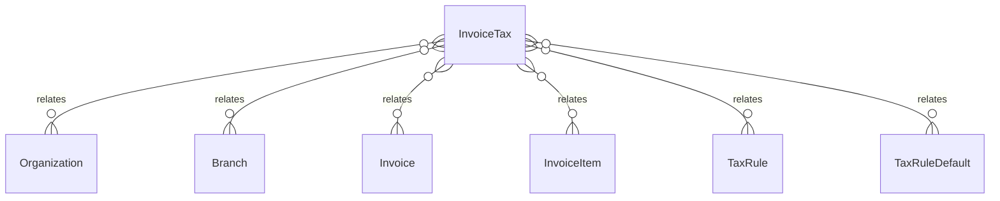

# `InvoiceTax` → `invoice_taxes`

<!-- generated by .kb/generate.mjs — do not edit by hand -->

Declared at `packages/db/prisma/schema/invoicing.prisma:587`.

| property | value |
| --- | --- |
| table | `invoice_taxes` |
| tenant-scoped | yes — has `organizationId` |
| RLS | **MISSING — this is a tenant-isolation defect** |
| columns | 14 |
| relations | 6 |

## Columns

| column | type | definition |
| --- | --- | --- |
| `id` | `String` | `id String @id @default(uuid()) @db.Uuid` |
| `organizationId` | `String` | `organizationId String @map("organization_id") @db.Uuid` |
| `branchId` | `String` | `branchId String @map("branch_id") @db.Uuid` |
| `invoiceId` | `String` | `invoiceId String @map("invoice_id") @db.Uuid` |
| `invoiceItemId` | `String` | `invoiceItemId String @map("invoice_item_id") @db.Uuid` |
| `taxRuleId` | `String?` | `taxRuleId String? @map("tax_rule_id") @db.Uuid` |
| `taxRuleDefaultId` | `String?` | `taxRuleDefaultId String? @map("tax_rule_default_id") @db.Uuid` |
| `name` | `String` | `name String @db.VarChar(32)` |
| `jurisdiction` | `String?` | `jurisdiction String? @db.VarChar(10)` |
| `rateBps` | `Int` | `rateBps Int @map("rate_bps")` |
| `taxableAmount` | `Decimal` | `taxableAmount Decimal @map("taxable_amount") @db.Decimal(14, 2)` |
| `taxAmount` | `Decimal` | `taxAmount Decimal @map("tax_amount") @db.Decimal(14, 2)` |
| `treatment` | `TaxTreatment` | `treatment TaxTreatment` |
| `createdAt` | `DateTime` | `createdAt DateTime @default(now()) @map("created_at") @db.Timestamptz(6)` |

## Relations

| field | target | definition |
| --- | --- | --- |
| `organization` | [`Organization`](Organization.md) | `organization Organization @relation(fields: [organizationId], references: [id], onDelete: Cascade)` |
| `branch` | [`Branch`](Branch.md) | `branch Branch @relation(fields: [organizationId, branchId], references: [organizationId, id], onDelete: Cascade)` |
| `invoice` | [`Invoice`](Invoice.md) | `invoice Invoice @relation(fields: [organizationId, invoiceId], references: [organizationId, id], onDelete: Cascade)` |
| `item` | [`InvoiceItem`](InvoiceItem.md) | `item InvoiceItem @relation(fields: [organizationId, invoiceItemId], references: [organizationId, id], onDelete: Cascade, onUpdate: NoAction)` |
| `taxRule` | [`TaxRule`](TaxRule.md) | `taxRule TaxRule? @relation(fields: [organizationId, taxRuleId], references: [organizationId, id], onDelete: Restrict, onUpdate: NoAction)` |
| `taxRuleDefault` | [`TaxRuleDefault`](TaxRuleDefault.md) | `taxRuleDefault TaxRuleDefault? @relation(fields: [taxRuleDefaultId], references: [id], onDelete: Restrict)` |

## Indexes and constraints

- `@@index([organizationId, invoiceId])`
- `@@index([organizationId, invoiceItemId])`

## Neighbourhood

