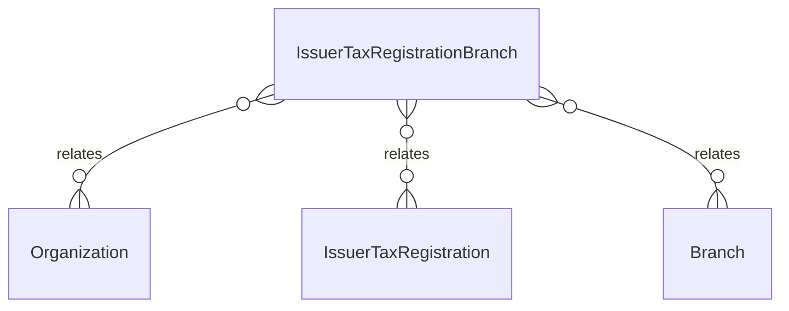

# `IssuerTaxRegistrationBranch` → `issuer_tax_registration_branches`

<!-- generated by .kb/generate.mjs — do not edit by hand -->

Declared at `packages/db/prisma/schema/tax.prisma:254`.

| property | value |
| --- | --- |
| table | `issuer_tax_registration_branches` |
| tenant-scoped | yes — has `organizationId` |
| RLS | `org` policy |
| columns | 7 |
| relations | 3 |

## Columns

| column | type | definition |
| --- | --- | --- |
| `id` | `String` | `id String @id @default(uuid()) @db.Uuid` |
| `organizationId` | `String` | `organizationId String @map("organization_id") @db.Uuid` |
| `taxRegistrationId` | `String` | `taxRegistrationId String @map("tax_registration_id") @db.Uuid` |
| `branchId` | `String` | `branchId String @map("branch_id") @db.Uuid` |
| `createdAt` | `DateTime` | `createdAt DateTime @default(now()) @map("created_at") @db.Timestamptz(6)` |
| `updatedAt` | `DateTime` | `updatedAt DateTime @updatedAt @map("updated_at") @db.Timestamptz(6)` |
| `deletedAt` | `DateTime?` | `deletedAt DateTime? @map("deleted_at") @db.Timestamptz(6)` |

## Relations

| field | target | definition |
| --- | --- | --- |
| `organization` | [`Organization`](Organization.md) | `organization Organization @relation(fields: [organizationId], references: [id], onDelete: Cascade)` |
| `registration` | [`IssuerTaxRegistration`](IssuerTaxRegistration.md) | `registration IssuerTaxRegistration @relation(fields: [organizationId, taxRegistrationId], references: [organizationId, id], onDelete: Cascade)` |
| `branch` | [`Branch`](Branch.md) | `branch Branch @relation(fields: [organizationId, branchId], references: [organizationId, id], onDelete: Cascade)` |

## Indexes and constraints

- `@@unique([organizationId, taxRegistrationId, branchId])`
- `@@index([organizationId, branchId])`

## Neighbourhood

