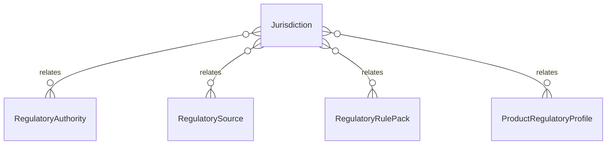

# `Jurisdiction` → `jurisdictions`

<!-- generated by .kb/generate.mjs — do not edit by hand -->

Declared at `packages/db/prisma/schema/regulatory.prisma:244`.

| property | value |
| --- | --- |
| table | `jurisdictions` |
| tenant-scoped | no |
| RLS | exempt — a jurisdiction is a place, not a clinic — platform reference data every tenant reads inside its own transaction (see en… |
| columns | 7 |
| relations | 4 |

## Columns

| column | type | definition |
| --- | --- | --- |
| `id` | `String` | `id String @id @default(uuid()) @db.Uuid` |
| `countryCode` | `String` | `countryCode String @map("country_code") @db.Char(2)` |
| `regionCode` | `String?` | `regionCode String? @map("region_code") @db.VarChar(16)` |
| `name` | `String` | `name String @db.VarChar(255)` |
| `isActive` | `Boolean` | `isActive Boolean @default(true) @map("is_active")` |
| `createdAt` | `DateTime` | `createdAt DateTime @default(now()) @map("created_at") @db.Timestamptz(6)` |
| `updatedAt` | `DateTime` | `updatedAt DateTime @updatedAt @map("updated_at") @db.Timestamptz(6)` |

## Relations

| field | target | definition |
| --- | --- | --- |
| `authorities` | [`RegulatoryAuthority`](RegulatoryAuthority.md) | `authorities RegulatoryAuthority[]` |
| `sources` | [`RegulatorySource`](RegulatorySource.md) | `sources RegulatorySource[]` |
| `rulePacks` | [`RegulatoryRulePack`](RegulatoryRulePack.md) | `rulePacks RegulatoryRulePack[]` |
| `productProfiles` | [`ProductRegulatoryProfile`](ProductRegulatoryProfile.md) | `productProfiles ProductRegulatoryProfile[]` |

## Indexes and constraints

- `@@unique([countryCode, regionCode])`
- `@@index([countryCode, isActive])`

## Neighbourhood

