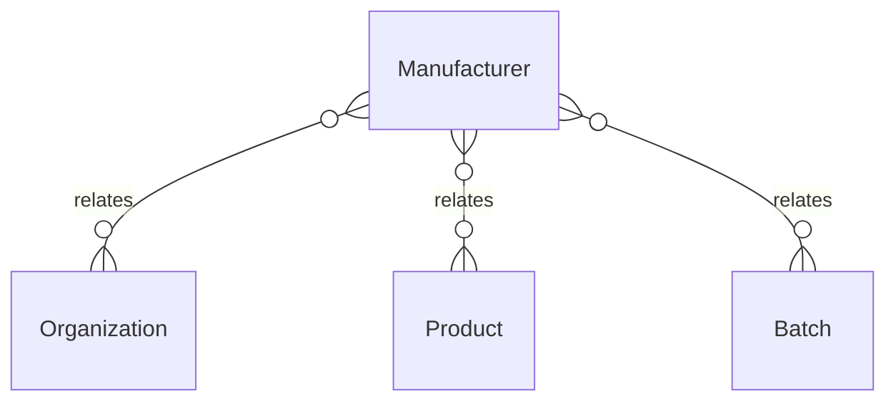

# `Manufacturer` → `manufacturers`

<!-- generated by .kb/generate.mjs — do not edit by hand -->

Declared at `packages/db/prisma/schema/products.prisma:363`.

| property | value |
| --- | --- |
| table | `manufacturers` |
| tenant-scoped | yes — has `organizationId` |
| RLS | **MISSING — this is a tenant-isolation defect** |
| columns | 11 |
| relations | 3 |

## Columns

| column | type | definition |
| --- | --- | --- |
| `id` | `String` | `id String @id @default(uuid()) @db.Uuid` |
| `organizationId` | `String?` | `organizationId String? @map("organization_id") @db.Uuid` |
| `code` | `String` | `code String @db.VarChar(64)` |
| `name` | `String` | `name String @db.VarChar(255)` |
| `countryCode` | `String?` | `countryCode String? @map("country_code") @db.Char(2)` |
| `licenceNumber` | `String?` | `licenceNumber String? @map("licence_number") @db.VarChar(128)` |
| `gs1Prefix` | `String?` | `gs1Prefix String? @map("gs1_prefix") @db.VarChar(16)` |
| `isActive` | `Boolean` | `isActive Boolean @default(true) @map("is_active")` |
| `createdAt` | `DateTime` | `createdAt DateTime @default(now()) @map("created_at") @db.Timestamptz(6)` |
| `updatedAt` | `DateTime` | `updatedAt DateTime @updatedAt @map("updated_at") @db.Timestamptz(6)` |
| `deletedAt` | `DateTime?` | `deletedAt DateTime? @map("deleted_at") @db.Timestamptz(6)` |

## Relations

| field | target | definition |
| --- | --- | --- |
| `organization` | [`Organization`](Organization.md) | `organization Organization? @relation(fields: [organizationId], references: [id], onDelete: Cascade)` |
| `products` | [`Product`](Product.md) | `products Product[]` |
| `batches` | [`Batch`](Batch.md) | `batches Batch[]` |

## Indexes and constraints

- `@@unique([organizationId, code])`
- `@@unique([organizationId, id])`
- `@@index([organizationId, isActive])`
- `@@index([organizationId, countryCode])`

## Neighbourhood

