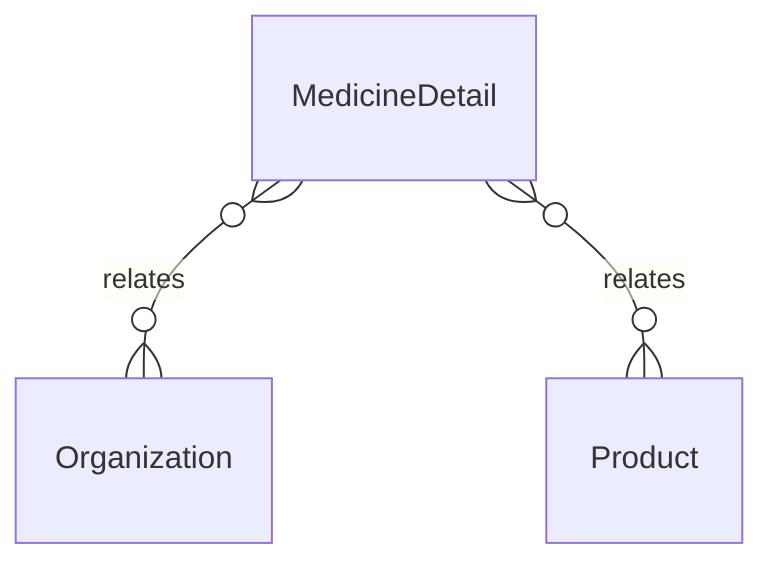

# `MedicineDetail` → `medicine_details`

<!-- generated by .kb/generate.mjs — do not edit by hand -->

Declared at `packages/db/prisma/schema/products.prisma:916`.

| property | value |
| --- | --- |
| table | `medicine_details` |
| tenant-scoped | yes — has `organizationId` |
| RLS | **MISSING — this is a tenant-isolation defect** |
| columns | 12 |
| relations | 2 |

## Columns

| column | type | definition |
| --- | --- | --- |
| `id` | `String` | `id String @id @default(uuid()) @db.Uuid` |
| `organizationId` | `String?` | `organizationId String? @map("organization_id") @db.Uuid` |
| `productId` | `String` | `productId String @map("product_id") @db.Uuid` |
| `dosageForm` | `DosageForm?` | `dosageForm DosageForm? @map("dosage_form")` |
| `route` | `AdministrationRoute?` | `route AdministrationRoute?` |
| `releaseType` | `ReleaseType?` | `releaseType ReleaseType? @map("release_type")` |
| `isNarrowTherapeuticIndex` | `Boolean` | `isNarrowTherapeuticIndex Boolean @default(false) @map("is_narrow_therapeutic_index")` |
| `prescriptionClassificationHint` | `String?` | `prescriptionClassificationHint String? @map("prescription_classification_hint") @db.VarChar(64)` |
| `labelInstructions` | `String?` | `labelInstructions String? @map("label_instructions") @db.Text` |
| `defaultCourseDays` | `Int?` | `defaultCourseDays Int? @map("default_course_days")` |
| `createdAt` | `DateTime` | `createdAt DateTime @default(now()) @map("created_at") @db.Timestamptz(6)` |
| `updatedAt` | `DateTime` | `updatedAt DateTime @updatedAt @map("updated_at") @db.Timestamptz(6)` |

## Relations

| field | target | definition |
| --- | --- | --- |
| `organization` | [`Organization`](Organization.md) | `organization Organization? @relation(fields: [organizationId], references: [id], onDelete: Cascade)` |
| `product` | [`Product`](Product.md) | `product Product? @relation(fields: [organizationId, productId], references: [organizationId, id], onDelete: Cascade)` |

## Indexes and constraints

- `@@unique([organizationId, productId])`

## Neighbourhood

