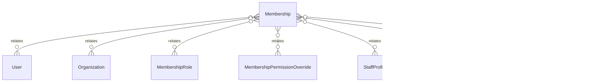

# `Membership` → `memberships`

<!-- generated by .kb/generate.mjs — do not edit by hand -->

Declared at `packages/db/prisma/schema/access-control.prisma:23`.

| property | value |
| --- | --- |
| table | `memberships` |
| tenant-scoped | yes — has `organizationId` |
| RLS | `org` policy |
| columns | 10 |
| relations | 7 |

## Columns

| column | type | definition |
| --- | --- | --- |
| `id` | `String` | `id String @id @default(uuid()) @db.Uuid` |
| `userId` | `String` | `userId String @map("user_id") @db.Uuid` |
| `organizationId` | `String` | `organizationId String @map("organization_id") @db.Uuid` |
| `status` | `MembershipStatus` | `status MembershipStatus @default(INVITED)` |
| `invitedBy` | `String?` | `invitedBy String? @map("invited_by") @db.Uuid` |
| `joinedAt` | `DateTime?` | `joinedAt DateTime? @map("joined_at") @db.Timestamptz(6)` |
| `lastBranchId` | `String?` | `lastBranchId String? @map("last_branch_id") @db.Uuid` |
| `createdAt` | `DateTime` | `createdAt DateTime @default(now()) @map("created_at") @db.Timestamptz(6)` |
| `updatedAt` | `DateTime` | `updatedAt DateTime @updatedAt @map("updated_at") @db.Timestamptz(6)` |
| `deletedAt` | `DateTime?` | `deletedAt DateTime? @map("deleted_at") @db.Timestamptz(6)` |

## Relations

| field | target | definition |
| --- | --- | --- |
| `user` | [`User`](User.md) | `user User @relation(fields: [userId], references: [id], onDelete: Cascade)` |
| `organization` | [`Organization`](Organization.md) | `organization Organization @relation(fields: [organizationId], references: [id], onDelete: Cascade)` |
| `roles` | [`MembershipRole`](MembershipRole.md) | `roles MembershipRole[]` |
| `overrides` | [`MembershipPermissionOverride`](MembershipPermissionOverride.md) | `overrides MembershipPermissionOverride[]` |
| `staffProfile` | [`StaffProfile`](StaffProfile.md) | `staffProfile StaffProfile?` |
| `professionalRegistrations` | [`MembershipProfessionalRegistration`](MembershipProfessionalRegistration.md) | `professionalRegistrations MembershipProfessionalRegistration[]` |
| `lastBranch` | [`Branch`](Branch.md) | `lastBranch Branch? @relation("MembershipLastBranch", fields: [organizationId, lastBranchId], references: [organizationId, id], onDelete: NoAction, onUpdate: NoAction)` |

## Indexes and constraints

- `@@unique([userId, organizationId])`
- `@@index([organizationId, status])`

## Neighbourhood

