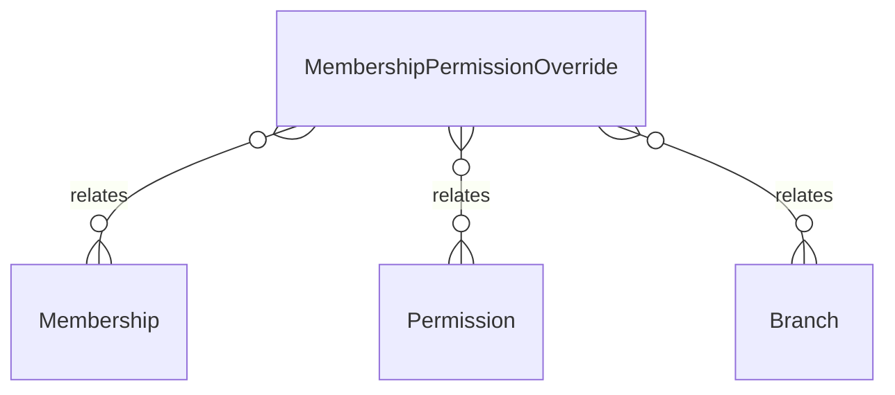

# `MembershipPermissionOverride` → `membership_permission_overrides`

<!-- generated by .kb/generate.mjs — do not edit by hand -->

Declared at `packages/db/prisma/schema/access-control.prisma:161`.

| property | value |
| --- | --- |
| table | `membership_permission_overrides` |
| tenant-scoped | yes — has `organizationId` |
| RLS | `branch` policy |
| columns | 8 |
| relations | 3 |

## Columns

| column | type | definition |
| --- | --- | --- |
| `id` | `String` | `id String @id @default(uuid()) @db.Uuid` |
| `membershipId` | `String` | `membershipId String @map("membership_id") @db.Uuid` |
| `organizationId` | `String` | `organizationId String @map("organization_id") @db.Uuid` |
| `permissionId` | `String` | `permissionId String @map("permission_id") @db.Uuid` |
| `branchId` | `String?` | `branchId String? @map("branch_id") @db.Uuid` |
| `effect` | `OverrideEffect` | `effect OverrideEffect` |
| `reason` | `String?` | `reason String? @db.VarChar(512)` |
| `createdAt` | `DateTime` | `createdAt DateTime @default(now()) @map("created_at") @db.Timestamptz(6)` |

## Relations

| field | target | definition |
| --- | --- | --- |
| `membership` | [`Membership`](Membership.md) | `membership Membership @relation(fields: [membershipId], references: [id], onDelete: Cascade)` |
| `permission` | [`Permission`](Permission.md) | `permission Permission @relation(fields: [permissionId], references: [id], onDelete: Cascade)` |
| `branch` | [`Branch`](Branch.md) | `branch Branch? @relation(fields: [organizationId, branchId], references: [organizationId, id], onDelete: Cascade)` |

## Indexes and constraints

- `@@unique([membershipId, permissionId, branchId])`
- `@@index([organizationId])`

## Neighbourhood

