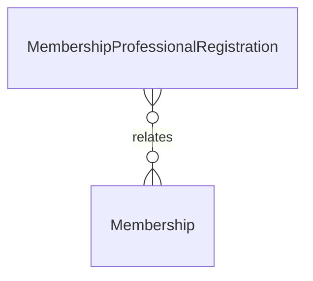

# `MembershipProfessionalRegistration` → `membership_professional_registrations`

<!-- generated by .kb/generate.mjs — do not edit by hand -->

Declared at `packages/db/prisma/schema/access-control.prisma:378`.

| property | value |
| --- | --- |
| table | `membership_professional_registrations` |
| tenant-scoped | no |
| RLS | `parent` policy |
| columns | 12 |
| relations | 1 |

## Columns

| column | type | definition |
| --- | --- | --- |
| `id` | `String` | `id String @id @default(uuid()) @db.Uuid` |
| `membershipId` | `String` | `membershipId String @map("membership_id") @db.Uuid` |
| `licenceType` | `String` | `licenceType String @map("licence_type") @db.VarChar(64)` |
| `registrationNumber` | `String` | `registrationNumber String @map("registration_number") @db.VarChar(128)` |
| `jurisdictionCode` | `String?` | `jurisdictionCode String? @map("jurisdiction_code") @db.VarChar(10)` |
| `authorityName` | `String?` | `authorityName String? @map("authority_name") @db.VarChar(255)` |
| `issuedOn` | `DateTime?` | `issuedOn DateTime? @map("issued_on") @db.Date` |
| `expiresOn` | `DateTime?` | `expiresOn DateTime? @map("expires_on") @db.Date` |
| `status` | `ProfessionalRegistrationStatus` | `status ProfessionalRegistrationStatus @default(ACTIVE)` |
| `createdAt` | `DateTime` | `createdAt DateTime @default(now()) @map("created_at") @db.Timestamptz(6)` |
| `updatedAt` | `DateTime` | `updatedAt DateTime @updatedAt @map("updated_at") @db.Timestamptz(6)` |
| `deletedAt` | `DateTime?` | `deletedAt DateTime? @map("deleted_at") @db.Timestamptz(6)` |

## Relations

| field | target | definition |
| --- | --- | --- |
| `membership` | [`Membership`](Membership.md) | `membership Membership @relation(fields: [membershipId], references: [id], onDelete: Cascade)` |

## Indexes and constraints

- `@@unique([membershipId, licenceType])`
- `@@index([membershipId, status])`

## Neighbourhood

