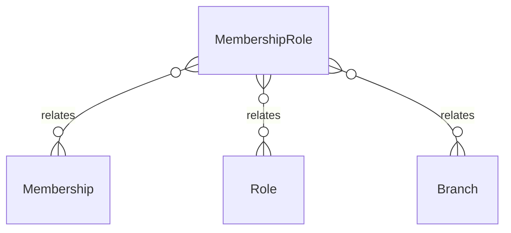

# `MembershipRole` → `membership_roles`

<!-- generated by .kb/generate.mjs — do not edit by hand -->

Declared at `packages/db/prisma/schema/access-control.prisma:138`.

| property | value |
| --- | --- |
| table | `membership_roles` |
| tenant-scoped | yes — has `organizationId` |
| RLS | `branch` policy |
| columns | 8 |
| relations | 3 |

## Columns

| column | type | definition |
| --- | --- | --- |
| `id` | `String` | `id String @id @default(uuid()) @db.Uuid` |
| `membershipId` | `String` | `membershipId String @map("membership_id") @db.Uuid` |
| `organizationId` | `String` | `organizationId String @map("organization_id") @db.Uuid` |
| `roleId` | `String` | `roleId String @map("role_id") @db.Uuid` |
| `branchId` | `String?` | `branchId String? @map("branch_id") @db.Uuid` |
| `validFrom` | `DateTime?` | `validFrom DateTime? @map("valid_from") @db.Timestamptz(6)` |
| `validTo` | `DateTime?` | `validTo DateTime? @map("valid_to") @db.Timestamptz(6)` |
| `createdAt` | `DateTime` | `createdAt DateTime @default(now()) @map("created_at") @db.Timestamptz(6)` |

## Relations

| field | target | definition |
| --- | --- | --- |
| `membership` | [`Membership`](Membership.md) | `membership Membership @relation(fields: [membershipId], references: [id], onDelete: Cascade)` |
| `role` | [`Role`](Role.md) | `role Role @relation(fields: [roleId], references: [id], onDelete: Cascade)` |
| `branch` | [`Branch`](Branch.md) | `branch Branch? @relation(fields: [organizationId, branchId], references: [organizationId, id], onDelete: Cascade)` |

## Indexes and constraints

- `@@unique([membershipId, roleId, branchId])`
- `@@index([organizationId, branchId])`

## Neighbourhood

