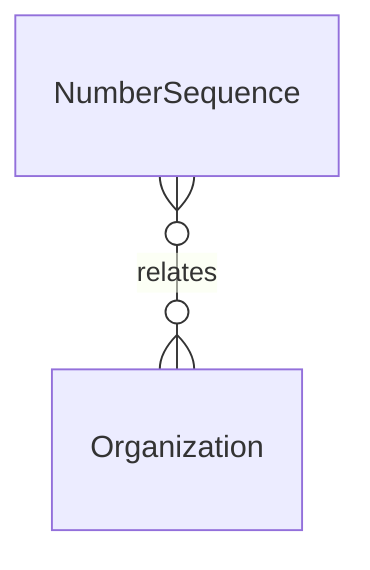

# `NumberSequence` → `number_sequences`

<!-- generated by .kb/generate.mjs — do not edit by hand -->

Declared at `packages/db/prisma/schema/numbering.prisma:102`.

| property | value |
| --- | --- |
| table | `number_sequences` |
| tenant-scoped | yes — has `organizationId` |
| RLS | `org` policy |
| columns | 10 |
| relations | 1 |

## Columns

| column | type | definition |
| --- | --- | --- |
| `id` | `String` | `id String @id @default(uuid()) @db.Uuid` |
| `organizationId` | `String` | `organizationId String @map("organization_id") @db.Uuid` |
| `branchId` | `String?` | `branchId String? @map("branch_id") @db.Uuid` |
| `sequenceType` | `NumberSequenceType` | `sequenceType NumberSequenceType @map("sequence_type")` |
| `periodKey` | `String` | `periodKey String @default("") @map("period_key") @db.VarChar(64)` |
| `prefix` | `String` | `prefix String @default("") @db.VarChar(64)` |
| `padding` | `Int` | `padding Int @default(6) @db.SmallInt` |
| `lastNumber` | `BigInt` | `lastNumber BigInt @default(0) @map("last_number")` |
| `createdAt` | `DateTime` | `createdAt DateTime @default(now()) @map("created_at") @db.Timestamptz(6)` |
| `updatedAt` | `DateTime` | `updatedAt DateTime @updatedAt @map("updated_at") @db.Timestamptz(6)` |

## Relations

| field | target | definition |
| --- | --- | --- |
| `organization` | [`Organization`](Organization.md) | `organization Organization @relation(fields: [organizationId], references: [id], onDelete: Cascade)` |

## Indexes and constraints

- `@@unique([organizationId, branchId, sequenceType, periodKey])`

## Neighbourhood

