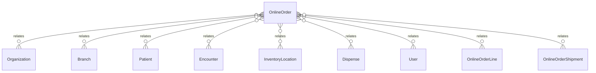

# `OnlineOrder` → `online_orders`

<!-- generated by .kb/generate.mjs — do not edit by hand -->

Declared at `packages/db/prisma/schema/online-pharmacy.prisma:125`.

| property | value |
| --- | --- |
| table | `online_orders` |
| tenant-scoped | yes — has `organizationId` |
| RLS | `branch` policy |
| columns | 32 |
| relations | 12 |

## Columns

| column | type | definition |
| --- | --- | --- |
| `id` | `String` | `id String @id @default(uuid()) @db.Uuid` |
| `organizationId` | `String` | `organizationId String @map("organization_id") @db.Uuid` |
| `branchId` | `String` | `branchId String @map("branch_id") @db.Uuid` |
| `orderNumber` | `String?` | `orderNumber String? @map("order_number") @db.VarChar(64)` |
| `channel` | `OnlineOrderChannel` | `channel OnlineOrderChannel` |
| `status` | `OnlineOrderStatus` | `status OnlineOrderStatus @default(DRAFT)` |
| `patientId` | `String` | `patientId String @map("patient_id") @db.Uuid` |
| `encounterId` | `String?` | `encounterId String? @map("encounter_id") @db.Uuid` |
| `locationId` | `String` | `locationId String @map("location_id") @db.Uuid` |
| `recipientName` | `String` | `recipientName String @map("recipient_name") @db.VarChar(255)` |
| `recipientPhone` | `String` | `recipientPhone String @map("recipient_phone") @db.VarChar(20)` |
| `addressLine1` | `String` | `addressLine1 String @map("address_line1") @db.VarChar(255)` |
| `addressLine2` | `String?` | `addressLine2 String? @map("address_line2") @db.VarChar(255)` |
| `city` | `String?` | `city String? @db.VarChar(100)` |
| `state` | `String?` | `state String? @db.VarChar(100)` |
| `pincode` | `String?` | `pincode String? @db.VarChar(10)` |
| `destinationCountryCode` | `String` | `destinationCountryCode String @map("destination_country_code") @db.Char(2)` |
| `destinationRegionCode` | `String?` | `destinationRegionCode String? @map("destination_region_code") @db.VarChar(16)` |
| `patientAddressId` | `String?` | `patientAddressId String? @map("patient_address_id") @db.Uuid` |
| `notes` | `String?` | `notes String? @db.Text` |
| `placedAt` | `DateTime` | `placedAt DateTime @default(now()) @map("placed_at") @db.Timestamptz(6)` |
| `placedById` | `String` | `placedById String @map("placed_by_id") @db.Uuid` |
| `confirmedAt` | `DateTime?` | `confirmedAt DateTime? @map("confirmed_at") @db.Timestamptz(6)` |
| `confirmedById` | `String?` | `confirmedById String? @map("confirmed_by_id") @db.Uuid` |
| `packedAt` | `DateTime?` | `packedAt DateTime? @map("packed_at") @db.Timestamptz(6)` |
| `packedById` | `String?` | `packedById String? @map("packed_by_id") @db.Uuid` |
| `cancelledAt` | `DateTime?` | `cancelledAt DateTime? @map("cancelled_at") @db.Timestamptz(6)` |
| `cancelledById` | `String?` | `cancelledById String? @map("cancelled_by_id") @db.Uuid` |
| `cancellationReason` | `String?` | `cancellationReason String? @map("cancellation_reason") @db.Text` |
| `dispenseId` | `String?` | `dispenseId String? @map("dispense_id") @db.Uuid` |
| `createdAt` | `DateTime` | `createdAt DateTime @default(now()) @map("created_at") @db.Timestamptz(6)` |
| `updatedAt` | `DateTime` | `updatedAt DateTime @updatedAt @map("updated_at") @db.Timestamptz(6)` |

## Relations

| field | target | definition |
| --- | --- | --- |
| `organization` | [`Organization`](Organization.md) | `organization Organization @relation(fields: [organizationId], references: [id], onDelete: Cascade)` |
| `branch` | [`Branch`](Branch.md) | `branch Branch @relation(fields: [organizationId, branchId], references: [organizationId, id], onDelete: Cascade)` |
| `patient` | [`Patient`](Patient.md) | `patient Patient @relation("OnlineOrderPatient", fields: [organizationId, patientId], references: [organizationId, id], onDelete: Restrict)` |
| `encounter` | [`Encounter`](Encounter.md) | `encounter Encounter? @relation("OnlineOrderEncounter", fields: [organizationId, encounterId], references: [organizationId, id], onDelete: Restrict)` |
| `location` | [`InventoryLocation`](InventoryLocation.md) | `location InventoryLocation @relation("OnlineOrderLocation", fields: [organizationId, branchId, locationId], references: [organizationId, branchId, id], onDelete: Restrict)` |
| `dispense` | [`Dispense`](Dispense.md) | `dispense Dispense? @relation("OnlineOrderDispense", fields: [organizationId, dispenseId], references: [organizationId, id], onDelete: Restrict)` |
| `placedBy` | [`User`](User.md) | `placedBy User @relation("OnlineOrderPlacedBy", fields: [placedById], references: [id], onDelete: Restrict)` |
| `confirmedBy` | [`User`](User.md) | `confirmedBy User? @relation("OnlineOrderConfirmedBy", fields: [confirmedById], references: [id], onDelete: Restrict)` |
| `packedBy` | [`User`](User.md) | `packedBy User? @relation("OnlineOrderPackedBy", fields: [packedById], references: [id], onDelete: Restrict)` |
| `cancelledBy` | [`User`](User.md) | `cancelledBy User? @relation("OnlineOrderCancelledBy", fields: [cancelledById], references: [id], onDelete: Restrict)` |
| `lines` | [`OnlineOrderLine`](OnlineOrderLine.md) | `lines OnlineOrderLine[]` |
| `shipment` | [`OnlineOrderShipment`](OnlineOrderShipment.md) | `shipment OnlineOrderShipment?` |

## Indexes and constraints

- `@@unique([organizationId, orderNumber])`
- `@@unique([organizationId, dispenseId])`
- `@@unique([organizationId, id])`
- `@@unique([organizationId, branchId, id])`
- `@@index([organizationId, branchId, status, placedAt])`
- `@@index([organizationId, patientId, placedAt(sort: Desc)])`
- `@@index([organizationId, encounterId])`

## Neighbourhood

