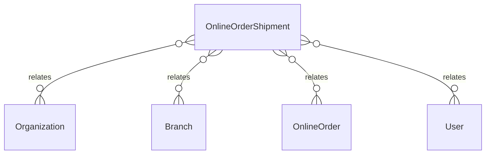

# `OnlineOrderShipment` → `online_order_shipments`

<!-- generated by .kb/generate.mjs — do not edit by hand -->

Declared at `packages/db/prisma/schema/online-pharmacy.prisma:344`.

| property | value |
| --- | --- |
| table | `online_order_shipments` |
| tenant-scoped | yes — has `organizationId` |
| RLS | `branch` policy |
| columns | 19 |
| relations | 6 |

## Columns

| column | type | definition |
| --- | --- | --- |
| `id` | `String` | `id String @id @default(uuid()) @db.Uuid` |
| `organizationId` | `String` | `organizationId String @map("organization_id") @db.Uuid` |
| `branchId` | `String` | `branchId String @map("branch_id") @db.Uuid` |
| `onlineOrderId` | `String` | `onlineOrderId String @map("online_order_id") @db.Uuid` |
| `carrierName` | `String` | `carrierName String @map("carrier_name") @db.VarChar(128)` |
| `serviceLevel` | `String?` | `serviceLevel String? @map("service_level") @db.VarChar(64)` |
| `trackingReference` | `String?` | `trackingReference String? @map("tracking_reference") @db.VarChar(128)` |
| `packageCount` | `Int` | `packageCount Int @default(1) @map("package_count") @db.SmallInt` |
| `shippedAt` | `DateTime` | `shippedAt DateTime @default(now()) @map("shipped_at") @db.Timestamptz(6)` |
| `shippedById` | `String` | `shippedById String @map("shipped_by_id") @db.Uuid` |
| `deliveredAt` | `DateTime?` | `deliveredAt DateTime? @map("delivered_at") @db.Timestamptz(6)` |
| `deliveredById` | `String?` | `deliveredById String? @map("delivered_by_id") @db.Uuid` |
| `receivedByName` | `String?` | `receivedByName String? @map("received_by_name") @db.VarChar(255)` |
| `failedAt` | `DateTime?` | `failedAt DateTime? @map("failed_at") @db.Timestamptz(6)` |
| `failedById` | `String?` | `failedById String? @map("failed_by_id") @db.Uuid` |
| `failureReason` | `String?` | `failureReason String? @map("failure_reason") @db.Text` |
| `notes` | `String?` | `notes String? @db.Text` |
| `createdAt` | `DateTime` | `createdAt DateTime @default(now()) @map("created_at") @db.Timestamptz(6)` |
| `updatedAt` | `DateTime` | `updatedAt DateTime @updatedAt @map("updated_at") @db.Timestamptz(6)` |

## Relations

| field | target | definition |
| --- | --- | --- |
| `organization` | [`Organization`](Organization.md) | `organization Organization @relation(fields: [organizationId], references: [id], onDelete: Cascade)` |
| `branch` | [`Branch`](Branch.md) | `branch Branch @relation(fields: [organizationId, branchId], references: [organizationId, id], onDelete: Cascade)` |
| `onlineOrder` | [`OnlineOrder`](OnlineOrder.md) | `onlineOrder OnlineOrder @relation(fields: [organizationId, onlineOrderId], references: [organizationId, id], onDelete: Cascade)` |
| `shippedBy` | [`User`](User.md) | `shippedBy User @relation("OnlineOrderShipmentShippedBy", fields: [shippedById], references: [id], onDelete: Restrict)` |
| `deliveredBy` | [`User`](User.md) | `deliveredBy User? @relation("OnlineOrderShipmentDeliveredBy", fields: [deliveredById], references: [id], onDelete: Restrict)` |
| `failedBy` | [`User`](User.md) | `failedBy User? @relation("OnlineOrderShipmentFailedBy", fields: [failedById], references: [id], onDelete: Restrict)` |

## Indexes and constraints

- `@@unique([organizationId, onlineOrderId])`
- `@@unique([organizationId, id])`
- `@@unique([organizationId, branchId, id])`
- `@@index([organizationId, branchId, shippedAt(sort: Desc)])`
- `@@index([organizationId, trackingReference])`

## Neighbourhood

