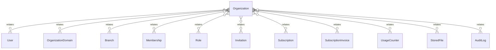

# `Organization` → `organizations`

<!-- generated by .kb/generate.mjs — do not edit by hand -->

Declared at `packages/db/prisma/schema.prisma:160`.

| property | value |
| --- | --- |
| table | `organizations` |
| tenant-scoped | no |
| RLS | exempt — resolved by hostname before a tenant context exists |
| columns | 15 |
| relations | 11 |

## Columns

| column | type | definition |
| --- | --- | --- |
| `id` | `String` | `id String @id @default(uuid()) @db.Uuid` |
| `slug` | `String` | `slug String @unique @db.VarChar(63)` |
| `legalName` | `String` | `legalName String @map("legal_name") @db.VarChar(255)` |
| `displayName` | `String` | `displayName String @map("display_name") @db.VarChar(255)` |
| `orgType` | `OrganizationType` | `orgType OrganizationType @default(CLINIC) @map("org_type")` |
| `status` | `OrganizationStatus` | `status OrganizationStatus @default(PENDING)` |
| `currency` | `String` | `currency String @default("INR") @db.Char(3)` |
| `timezone` | `String` | `timezone String @default("Asia/Kolkata") @db.VarChar(64)` |
| `countryCode` | `String` | `countryCode String @default("IN") @map("country_code") @db.Char(2)` |
| `gstNumber` | `String?` | `gstNumber String? @map("gst_number") @db.VarChar(20)` |
| `ownerUserId` | `String?` | `ownerUserId String? @map("owner_user_id") @db.Uuid` |
| `onboardedAt` | `DateTime?` | `onboardedAt DateTime? @map("onboarded_at") @db.Timestamptz(6)` |
| `createdAt` | `DateTime` | `createdAt DateTime @default(now()) @map("created_at") @db.Timestamptz(6)` |
| `updatedAt` | `DateTime` | `updatedAt DateTime @updatedAt @map("updated_at") @db.Timestamptz(6)` |
| `deletedAt` | `DateTime?` | `deletedAt DateTime? @map("deleted_at") @db.Timestamptz(6)` |

## Relations

| field | target | definition |
| --- | --- | --- |
| `owner` | [`User`](User.md) | `owner User? @relation("OrganizationOwner", fields: [ownerUserId], references: [id], onDelete: SetNull)` |
| `domains` | [`OrganizationDomain`](OrganizationDomain.md) | `domains OrganizationDomain[]` |
| `branches` | [`Branch`](Branch.md) | `branches Branch[]` |
| `memberships` | [`Membership`](Membership.md) | `memberships Membership[]` |
| `roles` | [`Role`](Role.md) | `roles Role[]` |
| `invitations` | [`Invitation`](Invitation.md) | `invitations Invitation[]` |
| `subscriptions` | [`Subscription`](Subscription.md) | `subscriptions Subscription[]` |
| `subscriptionInvoices` | [`SubscriptionInvoice`](SubscriptionInvoice.md) | `subscriptionInvoices SubscriptionInvoice[]` |
| `usageCounters` | [`UsageCounter`](UsageCounter.md) | `usageCounters UsageCounter[]` |
| `files` | [`StoredFile`](StoredFile.md) | `files StoredFile[]` |
| `auditLogs` | [`AuditLog`](AuditLog.md) | `auditLogs AuditLog[]` |

## Indexes and constraints

- `@@unique([id, slug])`
- `@@index([status])`
- `@@index([deletedAt])`

## Neighbourhood

