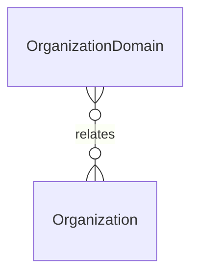

# `OrganizationDomain` → `organization_domains`

<!-- generated by .kb/generate.mjs — do not edit by hand -->

Declared at `packages/db/prisma/schema.prisma:198`.

| property | value |
| --- | --- |
| table | `organization_domains` |
| tenant-scoped | yes — has `organizationId` |
| RLS | exempt — the host -> tenant lookup itself; scoping it would be circular (see enable-rls.sql) |
| columns | 7 |
| relations | 1 |

## Columns

| column | type | definition |
| --- | --- | --- |
| `id` | `String` | `id String @id @default(uuid()) @db.Uuid` |
| `organizationId` | `String` | `organizationId String @map("organization_id") @db.Uuid` |
| `domain` | `String` | `domain String @unique @db.VarChar(255)` |
| `isPrimary` | `Boolean` | `isPrimary Boolean @default(false) @map("is_primary")` |
| `isPlatformSub` | `Boolean` | `isPlatformSub Boolean @default(true) @map("is_platform_subdomain")` |
| `verifiedAt` | `DateTime?` | `verifiedAt DateTime? @map("verified_at") @db.Timestamptz(6)` |
| `createdAt` | `DateTime` | `createdAt DateTime @default(now()) @map("created_at") @db.Timestamptz(6)` |

## Relations

| field | target | definition |
| --- | --- | --- |
| `organization` | [`Organization`](Organization.md) | `organization Organization @relation(fields: [organizationId], references: [id], onDelete: Cascade)` |

## Indexes and constraints

- `@@index([organizationId])`

## Neighbourhood

