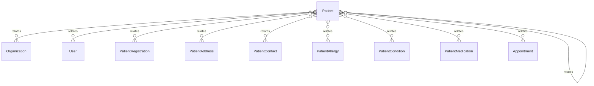

# `Patient` → `patients`

<!-- generated by .kb/generate.mjs — do not edit by hand -->

Declared at `packages/db/prisma/schema.prisma:1902`.

| property | value |
| --- | --- |
| table | `patients` |
| tenant-scoped | yes — has `organizationId` |
| RLS | **MISSING — this is a tenant-isolation defect** |
| columns | 21 |
| relations | 11 |

## Columns

| column | type | definition |
| --- | --- | --- |
| `id` | `String` | `id String @id @default(uuid()) @db.Uuid` |
| `organizationId` | `String` | `organizationId String @map("organization_id") @db.Uuid` |
| `uhid` | `String` | `uhid String @db.VarChar(32)` |
| `userId` | `String?` | `userId String? @map("user_id") @db.Uuid` |
| `firstName` | `String` | `firstName String @map("first_name") @db.VarChar(100)` |
| `lastName` | `String?` | `lastName String? @map("last_name") @db.VarChar(100)` |
| `dateOfBirth` | `DateTime?` | `dateOfBirth DateTime? @map("date_of_birth") @db.Date` |
| `approxAgeYears` | `Int?` | `approxAgeYears Int? @map("approx_age_years") @db.SmallInt` |
| `gender` | `Gender` | `gender Gender @default(UNKNOWN)` |
| `bloodGroup` | `BloodGroup` | `bloodGroup BloodGroup @default(UNKNOWN) @map("blood_group")` |
| `phone` | `String?` | `phone String? @db.VarChar(20)` |
| `email` | `String?` | `email String? @db.VarChar(255)` |
| `abhaNumber` | `String?` | `abhaNumber String? @map("abha_number") @db.VarChar(32)` |
| `nationalId` | `String?` | `nationalId String? @map("national_id") @db.VarChar(64)` |
| `maritalStatus` | `MaritalStatus` | `maritalStatus MaritalStatus @default(UNKNOWN) @map("marital_status")` |
| `status` | `PatientStatus` | `status PatientStatus @default(ACTIVE)` |
| `deceasedOn` | `DateTime?` | `deceasedOn DateTime? @map("deceased_on") @db.Date` |
| `mergedIntoId` | `String?` | `mergedIntoId String? @map("merged_into_id") @db.Uuid` |
| `createdAt` | `DateTime` | `createdAt DateTime @default(now()) @map("created_at") @db.Timestamptz(6)` |
| `updatedAt` | `DateTime` | `updatedAt DateTime @updatedAt @map("updated_at") @db.Timestamptz(6)` |
| `deletedAt` | `DateTime?` | `deletedAt DateTime? @map("deleted_at") @db.Timestamptz(6)` |

## Relations

| field | target | definition |
| --- | --- | --- |
| `organization` | [`Organization`](Organization.md) | `organization Organization @relation(fields: [organizationId], references: [id], onDelete: Cascade)` |
| `user` | [`User`](User.md) | `user User? @relation(fields: [userId], references: [id], onDelete: SetNull)` |
| `mergedInto` | [`Patient`](Patient.md) | `mergedInto Patient? @relation("PatientMerge", fields: [organizationId, mergedIntoId], references: [organizationId, id], onDelete: Restrict)` |
| `mergedFrom` | [`Patient`](Patient.md) | `mergedFrom Patient[] @relation("PatientMerge")` |
| `registrations` | [`PatientRegistration`](PatientRegistration.md) | `registrations PatientRegistration[]` |
| `addresses` | [`PatientAddress`](PatientAddress.md) | `addresses PatientAddress[]` |
| `contacts` | [`PatientContact`](PatientContact.md) | `contacts PatientContact[]` |
| `allergies` | [`PatientAllergy`](PatientAllergy.md) | `allergies PatientAllergy[]` |
| `conditions` | [`PatientCondition`](PatientCondition.md) | `conditions PatientCondition[]` |
| `medications` | [`PatientMedication`](PatientMedication.md) | `medications PatientMedication[]` |
| `appointments` | [`Appointment`](Appointment.md) | `appointments Appointment[]` |

## Indexes and constraints

- `@@unique([organizationId, uhid])`
- `@@unique([organizationId, id])`
- `@@index([organizationId, phone])`
- `@@index([organizationId, status])`
- `@@index([phone(ops: raw("gin_trgm_ops"))], map: "patients_phone_trgm_idx", type: Gin)`

## Neighbourhood

