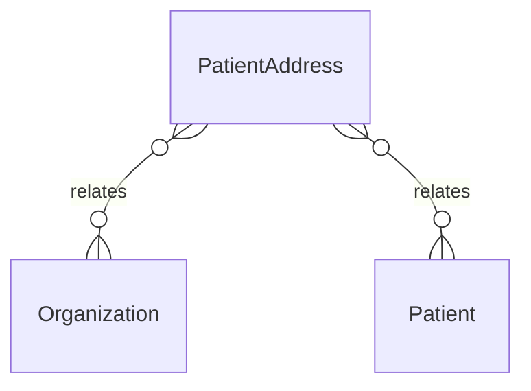

# `PatientAddress` → `patient_addresses`

<!-- generated by .kb/generate.mjs — do not edit by hand -->

Declared at `packages/db/prisma/schema/patients.prisma:293`.

| property | value |
| --- | --- |
| table | `patient_addresses` |
| tenant-scoped | yes — has `organizationId` |
| RLS | **MISSING — this is a tenant-isolation defect** |
| columns | 13 |
| relations | 2 |

## Columns

| column | type | definition |
| --- | --- | --- |
| `id` | `String` | `id String @id @default(uuid()) @db.Uuid` |
| `organizationId` | `String` | `organizationId String @map("organization_id") @db.Uuid` |
| `patientId` | `String` | `patientId String @map("patient_id") @db.Uuid` |
| `addressType` | `AddressType` | `addressType AddressType @default(HOME) @map("address_type")` |
| `line1` | `String` | `line1 String @db.VarChar(255)` |
| `line2` | `String?` | `line2 String? @db.VarChar(255)` |
| `city` | `String?` | `city String? @db.VarChar(100)` |
| `state` | `String?` | `state String? @db.VarChar(100)` |
| `pincode` | `String?` | `pincode String? @db.VarChar(10)` |
| `countryCode` | `String` | `countryCode String @default("IN") @map("country_code") @db.Char(2)` |
| `isPrimary` | `Boolean` | `isPrimary Boolean @default(false) @map("is_primary")` |
| `createdAt` | `DateTime` | `createdAt DateTime @default(now()) @map("created_at") @db.Timestamptz(6)` |
| `updatedAt` | `DateTime` | `updatedAt DateTime @updatedAt @map("updated_at") @db.Timestamptz(6)` |

## Relations

| field | target | definition |
| --- | --- | --- |
| `organization` | [`Organization`](Organization.md) | `organization Organization @relation(fields: [organizationId], references: [id], onDelete: Cascade)` |
| `patient` | [`Patient`](Patient.md) | `patient Patient @relation(fields: [organizationId, patientId], references: [organizationId, id], onDelete: Cascade)` |

## Indexes and constraints

- `@@index([organizationId, patientId])`

## Neighbourhood

