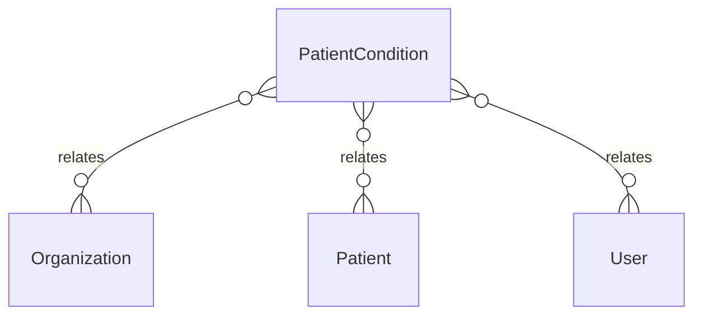

# `PatientCondition` → `patient_conditions`

<!-- generated by .kb/generate.mjs — do not edit by hand -->

Declared at `packages/db/prisma/schema/patients.prisma:385`.

| property | value |
| --- | --- |
| table | `patient_conditions` |
| tenant-scoped | yes — has `organizationId` |
| RLS | **MISSING — this is a tenant-isolation defect** |
| columns | 12 |
| relations | 3 |

## Columns

| column | type | definition |
| --- | --- | --- |
| `id` | `String` | `id String @id @default(uuid()) @db.Uuid` |
| `organizationId` | `String` | `organizationId String @map("organization_id") @db.Uuid` |
| `patientId` | `String` | `patientId String @map("patient_id") @db.Uuid` |
| `conditionText` | `String` | `conditionText String @map("condition_text") @db.VarChar(255)` |
| `status` | `PatientConditionStatus` | `status PatientConditionStatus @default(ACTIVE)` |
| `onsetDate` | `DateTime?` | `onsetDate DateTime? @map("onset_date") @db.Date` |
| `resolvedDate` | `DateTime?` | `resolvedDate DateTime? @map("resolved_date") @db.Date` |
| `note` | `String?` | `note String? @db.Text` |
| `notedBy` | `String?` | `notedBy String? @map("noted_by") @db.Uuid` |
| `deletedAt` | `DateTime?` | `deletedAt DateTime? @map("deleted_at") @db.Timestamptz(6)` |
| `createdAt` | `DateTime` | `createdAt DateTime @default(now()) @map("created_at") @db.Timestamptz(6)` |
| `updatedAt` | `DateTime` | `updatedAt DateTime @updatedAt @map("updated_at") @db.Timestamptz(6)` |

## Relations

| field | target | definition |
| --- | --- | --- |
| `organization` | [`Organization`](Organization.md) | `organization Organization @relation(fields: [organizationId], references: [id], onDelete: Cascade)` |
| `patient` | [`Patient`](Patient.md) | `patient Patient @relation(fields: [organizationId, patientId], references: [organizationId, id], onDelete: Cascade)` |
| `noter` | [`User`](User.md) | `noter User? @relation("ConditionNotedBy", fields: [notedBy], references: [id], onDelete: SetNull)` |

## Indexes and constraints

- `@@index([organizationId, patientId])`

## Neighbourhood

