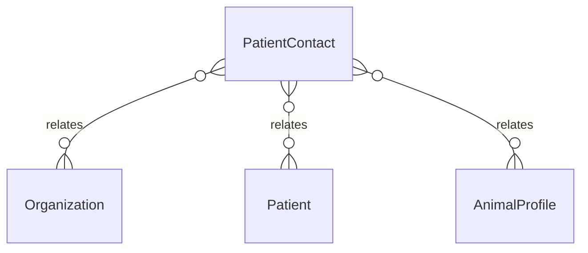

# `PatientContact` → `patient_contacts`

<!-- generated by .kb/generate.mjs — do not edit by hand -->

Declared at `packages/db/prisma/schema/patients.prisma:331`.

| property | value |
| --- | --- |
| table | `patient_contacts` |
| tenant-scoped | yes — has `organizationId` |
| RLS | **MISSING — this is a tenant-isolation defect** |
| columns | 11 |
| relations | 3 |

## Columns

| column | type | definition |
| --- | --- | --- |
| `id` | `String` | `id String @id @default(uuid()) @db.Uuid` |
| `organizationId` | `String` | `organizationId String @map("organization_id") @db.Uuid` |
| `patientId` | `String` | `patientId String @map("patient_id") @db.Uuid` |
| `relation` | `String` | `relation String @db.VarChar(64)` |
| `name` | `String` | `name String @db.VarChar(255)` |
| `phone` | `String` | `phone String @db.VarChar(20)` |
| `email` | `String?` | `email String? @db.VarChar(255)` |
| `isEmergency` | `Boolean` | `isEmergency Boolean @default(false) @map("is_emergency")` |
| `isGuardian` | `Boolean` | `isGuardian Boolean @default(false) @map("is_guardian")` |
| `createdAt` | `DateTime` | `createdAt DateTime @default(now()) @map("created_at") @db.Timestamptz(6)` |
| `updatedAt` | `DateTime` | `updatedAt DateTime @updatedAt @map("updated_at") @db.Timestamptz(6)` |

## Relations

| field | target | definition |
| --- | --- | --- |
| `organization` | [`Organization`](Organization.md) | `organization Organization @relation(fields: [organizationId], references: [id], onDelete: Cascade)` |
| `patient` | [`Patient`](Patient.md) | `patient Patient @relation(fields: [organizationId, patientId], references: [organizationId, id], onDelete: Cascade)` |
| `animalProfiles` | [`AnimalProfile`](AnimalProfile.md) | `animalProfiles AnimalProfile[]` |

## Indexes and constraints

- `@@unique([organizationId, id])`
- `@@index([organizationId, patientId])`

## Neighbourhood

