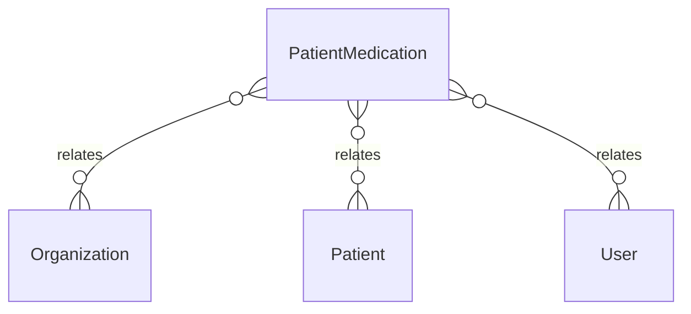

# `PatientMedication` → `patient_medications`

<!-- generated by .kb/generate.mjs — do not edit by hand -->

Declared at `packages/db/prisma/schema/patients.prisma:384`.

| property | value |
| --- | --- |
| table | `patient_medications` |
| tenant-scoped | yes — has `organizationId` |
| RLS | **MISSING — this is a tenant-isolation defect** |
| columns | 12 |
| relations | 3 |

## Columns

| column | type | definition |
| --- | --- | --- |
| `id` | `String` | `id String @id @default(uuid()) @db.Uuid` |
| `organizationId` | `String` | `organizationId String @map("organization_id") @db.Uuid` |
| `patientId` | `String` | `patientId String @map("patient_id") @db.Uuid` |
| `medicineText` | `String` | `medicineText String @map("medicine_text") @db.VarChar(255)` |
| `dosage` | `String?` | `dosage String? @db.VarChar(255)` |
| `startedOn` | `DateTime?` | `startedOn DateTime? @map("started_on") @db.Date` |
| `stoppedOn` | `DateTime?` | `stoppedOn DateTime? @map("stopped_on") @db.Date` |
| `isOngoing` | `Boolean` | `isOngoing Boolean @default(true) @map("is_ongoing")` |
| `notedBy` | `String?` | `notedBy String? @map("noted_by") @db.Uuid` |
| `deletedAt` | `DateTime?` | `deletedAt DateTime? @map("deleted_at") @db.Timestamptz(6)` |
| `createdAt` | `DateTime` | `createdAt DateTime @default(now()) @map("created_at") @db.Timestamptz(6)` |
| `updatedAt` | `DateTime` | `updatedAt DateTime @updatedAt @map("updated_at") @db.Timestamptz(6)` |

## Relations

| field | target | definition |
| --- | --- | --- |
| `organization` | [`Organization`](Organization.md) | `organization Organization @relation(fields: [organizationId], references: [id], onDelete: Cascade)` |
| `patient` | [`Patient`](Patient.md) | `patient Patient @relation(fields: [organizationId, patientId], references: [organizationId, id], onDelete: Cascade)` |
| `noter` | [`User`](User.md) | `noter User? @relation("MedicationNotedBy", fields: [notedBy], references: [id], onDelete: SetNull)` |

## Indexes and constraints

- `@@index([organizationId, patientId])`

## Neighbourhood

