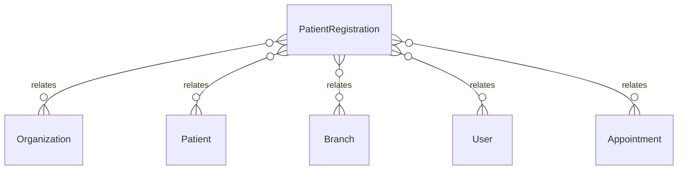

# `PatientRegistration` → `patient_registrations`

<!-- generated by .kb/generate.mjs — do not edit by hand -->

Declared at `packages/db/prisma/schema.prisma:2077`.

| property | value |
| --- | --- |
| table | `patient_registrations` |
| tenant-scoped | yes — has `organizationId` |
| RLS | **MISSING — this is a tenant-isolation defect** |
| columns | 10 |
| relations | 5 |

## Columns

| column | type | definition |
| --- | --- | --- |
| `id` | `String` | `id String @id @default(uuid()) @db.Uuid` |
| `organizationId` | `String` | `organizationId String @map("organization_id") @db.Uuid` |
| `patientId` | `String` | `patientId String @map("patient_id") @db.Uuid` |
| `branchId` | `String` | `branchId String @map("branch_id") @db.Uuid` |
| `mrn` | `String` | `mrn String @db.VarChar(32)` |
| `registeredAt` | `DateTime` | `registeredAt DateTime @default(now()) @map("registered_at") @db.Timestamptz(6)` |
| `registeredBy` | `String?` | `registeredBy String? @map("registered_by") @db.Uuid` |
| `status` | `PatientRegistrationStatus` | `status PatientRegistrationStatus @default(ACTIVE)` |
| `createdAt` | `DateTime` | `createdAt DateTime @default(now()) @map("created_at") @db.Timestamptz(6)` |
| `updatedAt` | `DateTime` | `updatedAt DateTime @updatedAt @map("updated_at") @db.Timestamptz(6)` |

## Relations

| field | target | definition |
| --- | --- | --- |
| `organization` | [`Organization`](Organization.md) | `organization Organization @relation(fields: [organizationId], references: [id], onDelete: Cascade)` |
| `patient` | [`Patient`](Patient.md) | `patient Patient @relation(fields: [organizationId, patientId], references: [organizationId, id], onDelete: Cascade)` |
| `branch` | [`Branch`](Branch.md) | `branch Branch @relation(fields: [organizationId, branchId], references: [organizationId, id], onDelete: Cascade)` |
| `registrar` | [`User`](User.md) | `registrar User? @relation("PatientRegisteredBy", fields: [registeredBy], references: [id], onDelete: SetNull)` |
| `appointments` | [`Appointment`](Appointment.md) | `appointments Appointment[]` |

## Indexes and constraints

- `@@unique([organizationId, patientId, branchId])`
- `@@unique([organizationId, branchId, mrn])`
- `@@unique([organizationId, id])`
- `@@index([organizationId, branchId, status])`

## Neighbourhood

