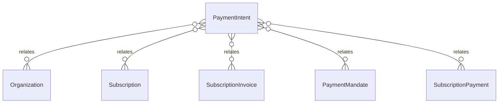

# `PaymentIntent` → `payment_intents`

<!-- generated by .kb/generate.mjs — do not edit by hand -->

Declared at `packages/db/prisma/schema.prisma:825`.

| property | value |
| --- | --- |
| table | `payment_intents` |
| tenant-scoped | yes — has `organizationId` |
| RLS | `org` policy |
| columns | 22 |
| relations | 5 |

## Columns

| column | type | definition |
| --- | --- | --- |
| `id` | `String` | `id String @id @default(uuid()) @db.Uuid` |
| `organizationId` | `String` | `organizationId String @map("organization_id") @db.Uuid` |
| `subscriptionId` | `String?` | `subscriptionId String? @map("subscription_id") @db.Uuid` |
| `invoiceId` | `String?` | `invoiceId String? @map("subscription_invoice_id") @db.Uuid` |
| `mandateId` | `String?` | `mandateId String? @map("mandate_id") @db.Uuid` |
| `provider` | `String` | `provider String @db.VarChar(32)` |
| `providerChargeId` | `String?` | `providerChargeId String? @map("provider_charge_id") @db.VarChar(128)` |
| `purpose` | `PaymentPurpose` | `purpose PaymentPurpose` |
| `status` | `PaymentIntentStatus` | `status PaymentIntentStatus @default(CREATED)` |
| `amount` | `Decimal` | `amount Decimal @db.Decimal(14, 2)` |
| `currency` | `String` | `currency String @db.Char(3)` |
| `description` | `String` | `description String @db.VarChar(255)` |
| `redirectUrl` | `String?` | `redirectUrl String? @map("redirect_url") @db.Text` |
| `returnUrl` | `String?` | `returnUrl String? @map("return_url") @db.Text` |
| `method` | `String?` | `method String? @db.VarChar(32)` |
| `instrumentLabel` | `String?` | `instrumentLabel String? @map("instrument_label") @db.VarChar(32)` |
| `failureCode` | `String?` | `failureCode String? @map("failure_code") @db.VarChar(64)` |
| `failureMessage` | `String?` | `failureMessage String? @map("failure_message") @db.VarChar(500)` |
| `settledAt` | `DateTime?` | `settledAt DateTime? @map("settled_at") @db.Timestamptz(6)` |
| `expiresAt` | `DateTime?` | `expiresAt DateTime? @map("expires_at") @db.Timestamptz(6)` |
| `createdAt` | `DateTime` | `createdAt DateTime @default(now()) @map("created_at") @db.Timestamptz(6)` |
| `updatedAt` | `DateTime` | `updatedAt DateTime @updatedAt @map("updated_at") @db.Timestamptz(6)` |

## Relations

| field | target | definition |
| --- | --- | --- |
| `organization` | [`Organization`](Organization.md) | `organization Organization @relation(fields: [organizationId], references: [id], onDelete: Cascade)` |
| `subscription` | [`Subscription`](Subscription.md) | `subscription Subscription? @relation(fields: [organizationId, subscriptionId], references: [organizationId, id], onDelete: Cascade)` |
| `invoice` | [`SubscriptionInvoice`](SubscriptionInvoice.md) | `invoice SubscriptionInvoice? @relation(fields: [organizationId, invoiceId], references: [organizationId, id], onDelete: Cascade)` |
| `mandate` | [`PaymentMandate`](PaymentMandate.md) | `mandate PaymentMandate? @relation(fields: [organizationId, mandateId], references: [organizationId, id], onDelete: NoAction, onUpdate: NoAction)` |
| `payments` | [`SubscriptionPayment`](SubscriptionPayment.md) | `payments SubscriptionPayment[]` |

## Indexes and constraints

- `@@unique([organizationId, id])`
- `@@unique([provider, providerChargeId])`
- `@@index([organizationId, status])`
- `@@index([subscriptionId])`

## Neighbourhood

