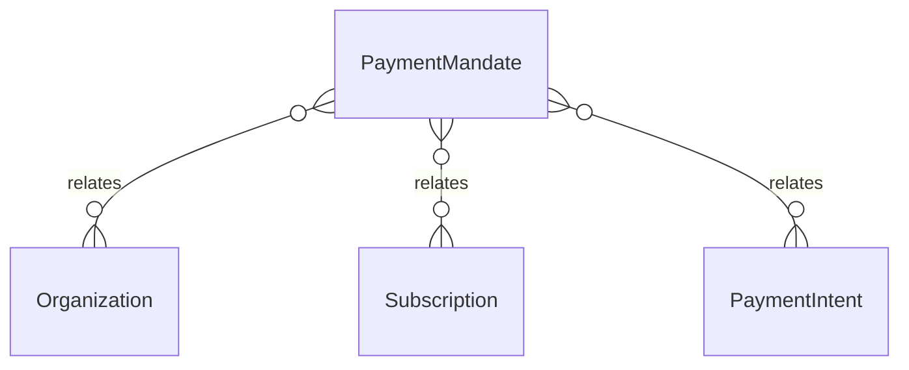

# `PaymentMandate` → `payment_mandates`

<!-- generated by .kb/generate.mjs — do not edit by hand -->

Declared at `packages/db/prisma/schema.prisma:1425`.

| property | value |
| --- | --- |
| table | `payment_mandates` |
| tenant-scoped | yes — has `organizationId` |
| RLS | `org` policy |
| columns | 14 |
| relations | 3 |

## Columns

| column | type | definition |
| --- | --- | --- |
| `id` | `String` | `id String @id @default(uuid()) @db.Uuid` |
| `organizationId` | `String` | `organizationId String @map("organization_id") @db.Uuid` |
| `provider` | `String` | `provider String @db.VarChar(32)` |
| `providerMandateId` | `String?` | `providerMandateId String? @map("provider_mandate_id") @db.VarChar(128)` |
| `status` | `MandateStatus` | `status MandateStatus @default(PENDING)` |
| `currency` | `String` | `currency String @db.Char(3)` |
| `maxAmount` | `Decimal` | `maxAmount Decimal @map("max_amount") @db.Decimal(14, 2)` |
| `method` | `String?` | `method String? @db.VarChar(32)` |
| `instrumentLabel` | `String?` | `instrumentLabel String? @map("instrument_label") @db.VarChar(32)` |
| `activatedAt` | `DateTime?` | `activatedAt DateTime? @map("activated_at") @db.Timestamptz(6)` |
| `revokedAt` | `DateTime?` | `revokedAt DateTime? @map("revoked_at") @db.Timestamptz(6)` |
| `expiresAt` | `DateTime?` | `expiresAt DateTime? @map("expires_at") @db.Timestamptz(6)` |
| `createdAt` | `DateTime` | `createdAt DateTime @default(now()) @map("created_at") @db.Timestamptz(6)` |
| `updatedAt` | `DateTime` | `updatedAt DateTime @updatedAt @map("updated_at") @db.Timestamptz(6)` |

## Relations

| field | target | definition |
| --- | --- | --- |
| `organization` | [`Organization`](Organization.md) | `organization Organization @relation(fields: [organizationId], references: [id], onDelete: Cascade)` |
| `subscriptions` | [`Subscription`](Subscription.md) | `subscriptions Subscription[]` |
| `intents` | [`PaymentIntent`](PaymentIntent.md) | `intents PaymentIntent[]` |

## Indexes and constraints

- `@@unique([organizationId, id])`
- `@@unique([provider, providerMandateId])`
- `@@index([organizationId, status])`

## Neighbourhood

