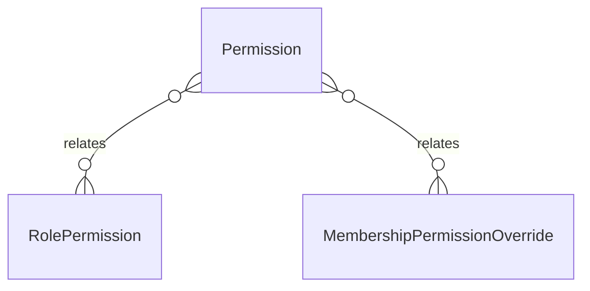

# `Permission` → `permissions`

<!-- generated by .kb/generate.mjs — do not edit by hand -->

Declared at `packages/db/prisma/schema.prisma:1360`.

| property | value |
| --- | --- |
| table | `permissions` |
| tenant-scoped | no |
| RLS | exempt — static catalogue |
| columns | 6 |
| relations | 2 |

## Columns

| column | type | definition |
| --- | --- | --- |
| `id` | `String` | `id String @id @default(uuid()) @db.Uuid` |
| `code` | `String` | `code String @unique @db.VarChar(128)` |
| `module` | `String` | `module String @db.VarChar(64)` |
| `action` | `String` | `action String @db.VarChar(64)` |
| `description` | `String?` | `description String? @db.VarChar(512)` |
| `createdAt` | `DateTime` | `createdAt DateTime @default(now()) @map("created_at") @db.Timestamptz(6)` |

## Relations

| field | target | definition |
| --- | --- | --- |
| `roles` | [`RolePermission`](RolePermission.md) | `roles RolePermission[]` |
| `overrides` | [`MembershipPermissionOverride`](MembershipPermissionOverride.md) | `overrides MembershipPermissionOverride[]` |

## Indexes and constraints

- `@@index([module])`

## Neighbourhood

