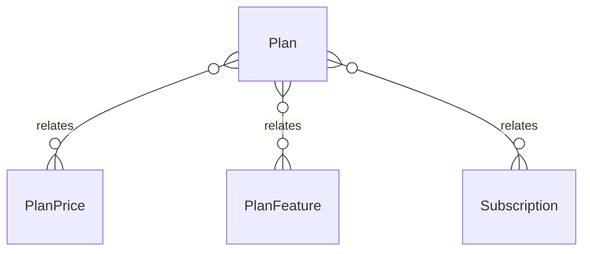

# `Plan` → `plans`

<!-- generated by .kb/generate.mjs — do not edit by hand -->

Declared at `packages/db/prisma/schema.prisma:628`.

| property | value |
| --- | --- |
| table | `plans` |
| tenant-scoped | no |
| RLS | exempt — platform-wide product catalogue |
| columns | 9 |
| relations | 3 |

## Columns

| column | type | definition |
| --- | --- | --- |
| `id` | `String` | `id String @id @default(uuid()) @db.Uuid` |
| `code` | `String` | `code String @unique @db.VarChar(64)` |
| `name` | `String` | `name String @db.VarChar(255)` |
| `tagline` | `String?` | `tagline String? @db.VarChar(255)` |
| `trialDays` | `Int` | `trialDays Int @default(14) @map("trial_days") @db.SmallInt` |
| `isPublic` | `Boolean` | `isPublic Boolean @default(true) @map("is_public")` |
| `sortOrder` | `Int` | `sortOrder Int @default(0) @map("sort_order")` |
| `createdAt` | `DateTime` | `createdAt DateTime @default(now()) @map("created_at") @db.Timestamptz(6)` |
| `updatedAt` | `DateTime` | `updatedAt DateTime @updatedAt @map("updated_at") @db.Timestamptz(6)` |

## Relations

| field | target | definition |
| --- | --- | --- |
| `prices` | [`PlanPrice`](PlanPrice.md) | `prices PlanPrice[]` |
| `features` | [`PlanFeature`](PlanFeature.md) | `features PlanFeature[]` |
| `subscriptions` | [`Subscription`](Subscription.md) | `subscriptions Subscription[]` |

## Neighbourhood

