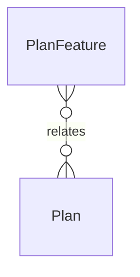

# `PlanFeature` → `plan_features`

<!-- generated by .kb/generate.mjs — do not edit by hand -->

Declared at `packages/db/prisma/schema.prisma:317`.

| property | value |
| --- | --- |
| table | `plan_features` |
| tenant-scoped | no |
| RLS | exempt — platform-wide product catalogue |
| columns | 6 |
| relations | 1 |

## Columns

| column | type | definition |
| --- | --- | --- |
| `id` | `String` | `id String @id @default(uuid()) @db.Uuid` |
| `planId` | `String` | `planId String @map("plan_id") @db.Uuid` |
| `featureKey` | `String` | `featureKey String @map("feature_key") @db.VarChar(64)` |
| `valueType` | `FeatureValueType` | `valueType FeatureValueType @map("value_type")` |
| `intValue` | `Int?` | `intValue Int? @map("int_value")` |
| `boolValue` | `Boolean?` | `boolValue Boolean? @map("bool_value")` |

## Relations

| field | target | definition |
| --- | --- | --- |
| `plan` | [`Plan`](Plan.md) | `plan Plan @relation(fields: [planId], references: [id], onDelete: Cascade)` |

## Indexes and constraints

- `@@unique([planId, featureKey])`

## Neighbourhood

