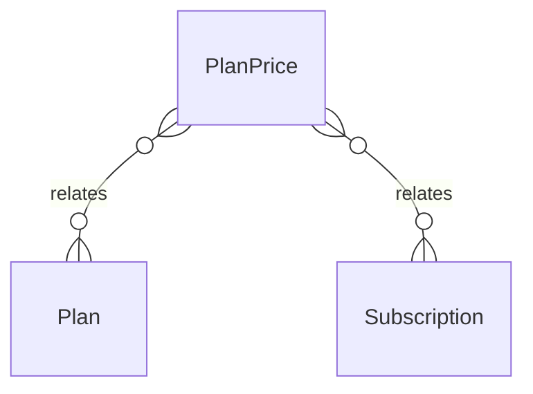

# `PlanPrice` → `plan_prices`

<!-- generated by .kb/generate.mjs — do not edit by hand -->

Declared at `packages/db/prisma/schema/subscriptions.prisma:142`.

| property | value |
| --- | --- |
| table | `plan_prices` |
| tenant-scoped | no |
| RLS | exempt — platform-wide product catalogue |
| columns | 7 |
| relations | 2 |

## Columns

| column | type | definition |
| --- | --- | --- |
| `id` | `String` | `id String @id @default(uuid()) @db.Uuid` |
| `planId` | `String` | `planId String @map("plan_id") @db.Uuid` |
| `currency` | `String` | `currency String @default("INR") @db.Char(3)` |
| `billingInterval` | `BillingInterval` | `billingInterval BillingInterval @map("billing_interval")` |
| `amount` | `Decimal` | `amount Decimal @db.Decimal(14, 2)` |
| `taxBehavior` | `TaxBehavior` | `taxBehavior TaxBehavior @default(EXCLUSIVE) @map("tax_behavior")` |
| `isActive` | `Boolean` | `isActive Boolean @default(true) @map("is_active")` |

## Relations

| field | target | definition |
| --- | --- | --- |
| `plan` | [`Plan`](Plan.md) | `plan Plan @relation(fields: [planId], references: [id], onDelete: Cascade)` |
| `subscriptions` | [`Subscription`](Subscription.md) | `subscriptions Subscription[]` |

## Indexes and constraints

- `@@unique([planId, currency, billingInterval])`

## Neighbourhood

