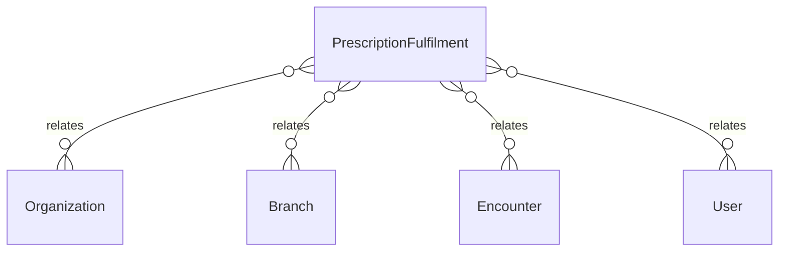

# `PrescriptionFulfilment` → `prescription_fulfilments`

<!-- generated by .kb/generate.mjs — do not edit by hand -->

Declared at `packages/db/prisma/schema/pharmacy.prisma:120`.

| property | value |
| --- | --- |
| table | `prescription_fulfilments` |
| tenant-scoped | yes — has `organizationId` |
| RLS | `org` policy |
| columns | 12 |
| relations | 5 |

## Columns

| column | type | definition |
| --- | --- | --- |
| `id` | `String` | `id String @id @default(uuid()) @db.Uuid` |
| `organizationId` | `String` | `organizationId String @map("organization_id") @db.Uuid` |
| `branchId` | `String` | `branchId String @map("branch_id") @db.Uuid` |
| `encounterId` | `String` | `encounterId String @map("encounter_id") @db.Uuid` |
| `status` | `PrescriptionFulfilmentStatus` | `status PrescriptionFulfilmentStatus @default(VERIFIED)` |
| `verifiedById` | `String?` | `verifiedById String? @map("verified_by_id") @db.Uuid` |
| `verifiedAt` | `DateTime?` | `verifiedAt DateTime? @map("verified_at") @db.Timestamptz(6)` |
| `notes` | `String?` | `notes String? @db.Text` |
| `cancelledById` | `String?` | `cancelledById String? @map("cancelled_by_id") @db.Uuid` |
| `cancelledAt` | `DateTime?` | `cancelledAt DateTime? @map("cancelled_at") @db.Timestamptz(6)` |
| `createdAt` | `DateTime` | `createdAt DateTime @default(now()) @map("created_at") @db.Timestamptz(6)` |
| `updatedAt` | `DateTime` | `updatedAt DateTime @updatedAt @map("updated_at") @db.Timestamptz(6)` |

## Relations

| field | target | definition |
| --- | --- | --- |
| `organization` | [`Organization`](Organization.md) | `organization Organization @relation(fields: [organizationId], references: [id], onDelete: Cascade)` |
| `branch` | [`Branch`](Branch.md) | `branch Branch @relation(fields: [organizationId, branchId], references: [organizationId, id], onDelete: Cascade)` |
| `encounter` | [`Encounter`](Encounter.md) | `encounter Encounter @relation(fields: [organizationId, encounterId], references: [organizationId, id], onDelete: Cascade)` |
| `verifiedBy` | [`User`](User.md) | `verifiedBy User? @relation("PrescriptionFulfilmentVerifiedBy", fields: [verifiedById], references: [id], onDelete: Restrict)` |
| `cancelledBy` | [`User`](User.md) | `cancelledBy User? @relation("PrescriptionFulfilmentCancelledBy", fields: [cancelledById], references: [id], onDelete: Restrict)` |

## Indexes and constraints

- `@@unique([organizationId, encounterId])`
- `@@unique([organizationId, id])`
- `@@index([organizationId, branchId, status, createdAt])`

## Neighbourhood

