# `Product` → `products`

<!-- generated by .kb/generate.mjs — do not edit by hand -->

Declared at `packages/db/prisma/schema/products.prisma:607`.

| property | value |
| --- | --- |
| table | `products` |
| tenant-scoped | yes — has `organizationId` |
| RLS | `visible` policy |
| columns | 25 |
| relations | 31 |

## Columns

| column | type | definition |
| --- | --- | --- |
| `id` | `String` | `id String @id @default(uuid()) @db.Uuid` |
| `organizationId` | `String?` | `organizationId String? @map("organization_id") @db.Uuid` |
| `type` | `ProductType` | `type ProductType` |
| `status` | `ProductStatus` | `status ProductStatus @default(DRAFT)` |
| `code` | `String` | `code String @db.VarChar(64)` |
| `name` | `String` | `name String @db.VarChar(500)` |
| `brandName` | `String?` | `brandName String? @map("brand_name") @db.VarChar(255)` |
| `genericName` | `String?` | `genericName String? @map("generic_name") @db.VarChar(255)` |
| `description` | `String?` | `description String? @db.Text` |
| `categoryId` | `String?` | `categoryId String? @map("category_id") @db.Uuid` |
| `manufacturerId` | `String?` | `manufacturerId String? @map("manufacturer_id") @db.Uuid` |
| `compositionId` | `String?` | `compositionId String? @map("composition_id") @db.Uuid` |
| `storageProfileId` | `String?` | `storageProfileId String? @map("storage_profile_id") @db.Uuid` |
| `baseUnitId` | `String` | `baseUnitId String @map("base_unit_id") @db.Uuid` |
| `trackingMode` | `TrackingMode` | `trackingMode TrackingMode @default(NONE) @map("tracking_mode")` |
| `isExpiryControlled` | `Boolean` | `isExpiryControlled Boolean @default(false) @map("is_expiry_controlled")` |
| `defaultShelfLifeDays` | `Int?` | `defaultShelfLifeDays Int? @map("default_shelf_life_days")` |
| `reorderLevelBase` | `Decimal?` | `reorderLevelBase Decimal? @map("reorder_level_base") @db.Decimal(18, 6)` |
| `reorderQuantityBase` | `Decimal?` | `reorderQuantityBase Decimal? @map("reorder_quantity_base") @db.Decimal(18, 6)` |
| `isStockItem` | `Boolean` | `isStockItem Boolean @default(true) @map("is_stock_item")` |
| `allocationStrategy` | `AllocationStrategy?` | `allocationStrategy AllocationStrategy? @map("allocation_strategy")` |
| `metadata` | `Json?` | `metadata Json? @db.JsonB` |
| `createdAt` | `DateTime` | `createdAt DateTime @default(now()) @map("created_at") @db.Timestamptz(6)` |
| `updatedAt` | `DateTime` | `updatedAt DateTime @updatedAt @map("updated_at") @db.Timestamptz(6)` |
| `deletedAt` | `DateTime?` | `deletedAt DateTime? @map("deleted_at") @db.Timestamptz(6)` |

## Relations

| field | target | definition |
| --- | --- | --- |
| `organization` | [`Organization`](Organization.md) | `organization Organization? @relation(fields: [organizationId], references: [id], onDelete: Cascade)` |
| `category` | [`ProductCategory`](ProductCategory.md) | `category ProductCategory? @relation(fields: [categoryId], references: [id], onDelete: Restrict)` |
| `manufacturer` | [`Manufacturer`](Manufacturer.md) | `manufacturer Manufacturer? @relation(fields: [manufacturerId], references: [id], onDelete: Restrict)` |
| `composition` | [`Composition`](Composition.md) | `composition Composition? @relation(fields: [compositionId], references: [id], onDelete: Restrict)` |
| `storageProfile` | [`StorageRequirementProfile`](StorageRequirementProfile.md) | `storageProfile StorageRequirementProfile? @relation(fields: [storageProfileId], references: [id], onDelete: Restrict)` |
| `baseUnit` | [`UnitOfMeasure`](UnitOfMeasure.md) | `baseUnit UnitOfMeasure @relation("ProductBaseUnit", fields: [baseUnitId], references: [id], onDelete: Restrict)` |
| `packagings` | [`ProductPackaging`](ProductPackaging.md) | `packagings ProductPackaging[]` |
| `identifiers` | [`ProductIdentifier`](ProductIdentifier.md) | `identifiers ProductIdentifier[]` |
| `taxClassifications` | [`ProductTaxClassification`](ProductTaxClassification.md) | `taxClassifications ProductTaxClassification[]` |
| `medicineDetail` | [`MedicineDetail`](MedicineDetail.md) | `medicineDetail MedicineDetail?` |
| `batches` | [`Batch`](Batch.md) | `batches Batch[]` |
| `serials` | [`Serial`](Serial.md) | `serials Serial[]` |
| `stockLedgerEntries` | [`StockLedgerEntry`](StockLedgerEntry.md) | `stockLedgerEntries StockLedgerEntry[]` |
| `stockBalances` | [`StockBalance`](StockBalance.md) | `stockBalances StockBalance[]` |
| `transferLines` | [`StockTransferLine`](StockTransferLine.md) | `transferLines StockTransferLine[]` |
| `reservations` | [`StockReservation`](StockReservation.md) | `reservations StockReservation[]` |
| `supplierProducts` | [`SupplierProduct`](SupplierProduct.md) | `supplierProducts SupplierProduct[]` |
| `requisitionLines` | [`PurchaseRequisitionLine`](PurchaseRequisitionLine.md) | `requisitionLines PurchaseRequisitionLine[]` |
| `purchaseOrderLines` | [`PurchaseOrderLine`](PurchaseOrderLine.md) | `purchaseOrderLines PurchaseOrderLine[]` |
| `goodsReceiptLines` | [`GoodsReceiptLine`](GoodsReceiptLine.md) | `goodsReceiptLines GoodsReceiptLine[]` |
| `purchaseReturnLines` | [`PurchaseReturnLine`](PurchaseReturnLine.md) | `purchaseReturnLines PurchaseReturnLine[]` |
| `costAverages` | [`ProductCostAverage`](ProductCostAverage.md) | `costAverages ProductCostAverage[]` |
| `regulatoryProfiles` | [`ProductRegulatoryProfile`](ProductRegulatoryProfile.md) | `regulatoryProfiles ProductRegulatoryProfile[]` |
| `dispenseLines` | [`DispenseLine`](DispenseLine.md) | `dispenseLines DispenseLine[] @relation("DispenseLineProduct")` |
| `dispenseSubstitutions` | [`DispenseLine`](DispenseLine.md) | `dispenseSubstitutions DispenseLine[] @relation("DispenseLineSubstitutedFor")` |
| `regulatoryDecisions` | [`RegulatoryDecision`](RegulatoryDecision.md) | `regulatoryDecisions RegulatoryDecision[]` |
| `chargePolicyRules` | [`ChargePolicyRule`](ChargePolicyRule.md) | `chargePolicyRules ChargePolicyRule[] @relation("ChargePolicyRuleProduct")` |
| `prices` | [`ProductPrice`](ProductPrice.md) | `prices ProductPrice[] @relation("ProductPriceProduct")` |
| `chargeRequests` | [`ChargeRequest`](ChargeRequest.md) | `chargeRequests ChargeRequest[] @relation("ChargeRequestProduct")` |
| `clinicalScopes` | [`ProductClinicalScope`](ProductClinicalScope.md) | `clinicalScopes ProductClinicalScope[]` |
| `prescriptions` | [`EncounterPrescription`](EncounterPrescription.md) | `prescriptions EncounterPrescription[]` |

## Indexes and constraints

- `@@unique([organizationId, code])`
- `@@unique([organizationId, id])`
- `@@index([organizationId, status, type])`
- `@@index([organizationId, categoryId])`
- `@@index([organizationId, compositionId])`
- `@@index([organizationId, manufacturerId])`
- `@@index([organizationId, name])`

## Neighbourhood

```mermaid
erDiagram
    Product }o--o{ Organization : relates
    Product }o--o{ ProductCategory : relates
    Product }o--o{ Manufacturer : relates
    Product }o--o{ Composition : relates
    Product }o--o{ StorageRequirementProfile : relates
    Product }o--o{ UnitOfMeasure : relates
    Product }o--o{ ProductPackaging : relates
    Product }o--o{ ProductIdentifier : relates
    Product }o--o{ ProductTaxClassification : relates
    Product }o--o{ MedicineDetail : relates
    Product }o--o{ Batch : relates
    Product }o--o{ Serial : relates
    Product }o--o{ StockLedgerEntry : relates
    Product }o--o{ StockBalance : relates
    Product }o--o{ StockTransferLine : relates
    Product }o--o{ StockReservation : relates
    Product }o--o{ SupplierProduct : relates
    Product }o--o{ PurchaseRequisitionLine : relates
    Product }o--o{ PurchaseOrderLine : relates
    Product }o--o{ GoodsReceiptLine : relates
    Product }o--o{ PurchaseReturnLine : relates
    Product }o--o{ ProductCostAverage : relates
    Product }o--o{ ProductRegulatoryProfile : relates
    Product }o--o{ DispenseLine : relates
    Product }o--o{ RegulatoryDecision : relates
    Product }o--o{ ChargePolicyRule : relates
    Product }o--o{ ProductPrice : relates
    Product }o--o{ ChargeRequest : relates
    Product }o--o{ ProductClinicalScope : relates
    Product }o--o{ EncounterPrescription : relates
```

