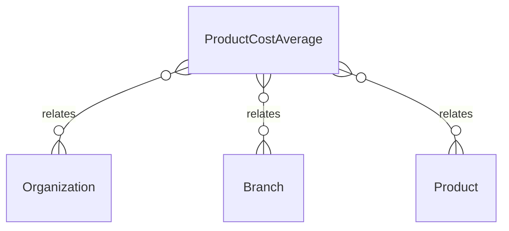

# `ProductCostAverage` → `product_cost_averages`

<!-- generated by .kb/generate.mjs — do not edit by hand -->

Declared at `packages/db/prisma/schema/procurement.prisma:1220`.

| property | value |
| --- | --- |
| table | `product_cost_averages` |
| tenant-scoped | yes — has `organizationId` |
| RLS | `branch` policy |
| columns | 11 |
| relations | 3 |

## Columns

| column | type | definition |
| --- | --- | --- |
| `id` | `String` | `id String @id @default(uuid()) @db.Uuid` |
| `organizationId` | `String` | `organizationId String @map("organization_id") @db.Uuid` |
| `branchId` | `String` | `branchId String @map("branch_id") @db.Uuid` |
| `productId` | `String` | `productId String @map("product_id") @db.Uuid` |
| `currency` | `String` | `currency String @db.Char(3)` |
| `valuedQuantityBase` | `Decimal` | `valuedQuantityBase Decimal @map("valued_quantity_base") @db.Decimal(18, 6)` |
| `valuedCostMinor` | `BigInt` | `valuedCostMinor BigInt @map("valued_cost_minor") @db.BigInt` |
| `receiptCount` | `Int` | `receiptCount Int @default(0) @map("receipt_count")` |
| `lastReceiptAt` | `DateTime?` | `lastReceiptAt DateTime? @map("last_receipt_at") @db.Timestamptz(6)` |
| `createdAt` | `DateTime` | `createdAt DateTime @default(now()) @map("created_at") @db.Timestamptz(6)` |
| `updatedAt` | `DateTime` | `updatedAt DateTime @updatedAt @map("updated_at") @db.Timestamptz(6)` |

## Relations

| field | target | definition |
| --- | --- | --- |
| `organization` | [`Organization`](Organization.md) | `organization Organization @relation(fields: [organizationId], references: [id], onDelete: Cascade)` |
| `branch` | [`Branch`](Branch.md) | `branch Branch @relation(fields: [organizationId, branchId], references: [organizationId, id], onDelete: Cascade)` |
| `product` | [`Product`](Product.md) | `product Product @relation(fields: [productId], references: [id], onDelete: Restrict)` |

## Indexes and constraints

- `@@unique([organizationId, branchId, productId, currency])`

## Neighbourhood

