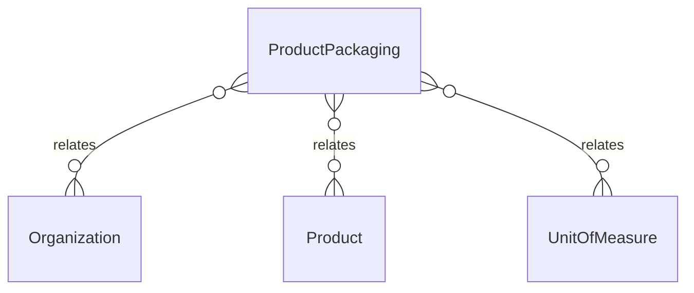

# `ProductPackaging` → `product_packagings`

<!-- generated by .kb/generate.mjs — do not edit by hand -->

Declared at `packages/db/prisma/schema/products.prisma:729`.

| property | value |
| --- | --- |
| table | `product_packagings` |
| tenant-scoped | yes — has `organizationId` |
| RLS | `visible` policy |
| columns | 11 |
| relations | 3 |

## Columns

| column | type | definition |
| --- | --- | --- |
| `id` | `String` | `id String @id @default(uuid()) @db.Uuid` |
| `organizationId` | `String?` | `organizationId String? @map("organization_id") @db.Uuid` |
| `productId` | `String` | `productId String @map("product_id") @db.Uuid` |
| `level` | `Int` | `level Int` |
| `unitId` | `String` | `unitId String @map("unit_id") @db.Uuid` |
| `quantityOfChild` | `Decimal` | `quantityOfChild Decimal @map("quantity_of_child") @db.Decimal(18, 6)` |
| `isDefaultPurchase` | `Boolean` | `isDefaultPurchase Boolean @default(false) @map("is_default_purchase")` |
| `isDefaultSale` | `Boolean` | `isDefaultSale Boolean @default(false) @map("is_default_sale")` |
| `barcode` | `String?` | `barcode String? @db.VarChar(128)` |
| `createdAt` | `DateTime` | `createdAt DateTime @default(now()) @map("created_at") @db.Timestamptz(6)` |
| `updatedAt` | `DateTime` | `updatedAt DateTime @updatedAt @map("updated_at") @db.Timestamptz(6)` |

## Relations

| field | target | definition |
| --- | --- | --- |
| `organization` | [`Organization`](Organization.md) | `organization Organization? @relation(fields: [organizationId], references: [id], onDelete: Cascade)` |
| `product` | [`Product`](Product.md) | `product Product? @relation(fields: [organizationId, productId], references: [organizationId, id], onDelete: Cascade)` |
| `unit` | [`UnitOfMeasure`](UnitOfMeasure.md) | `unit UnitOfMeasure @relation(fields: [unitId], references: [id], onDelete: Restrict)` |

## Indexes and constraints

- `@@unique([organizationId, productId, level])`
- `@@index([organizationId, productId])`

## Neighbourhood

