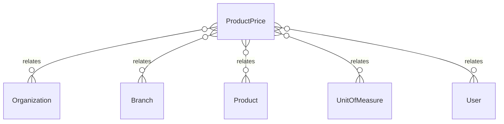

# `ProductPrice` → `product_prices`

<!-- generated by .kb/generate.mjs — do not edit by hand -->

Declared at `packages/db/prisma/schema/charging.prisma:213`.

| property | value |
| --- | --- |
| table | `product_prices` |
| tenant-scoped | yes — has `organizationId` |
| RLS | `branch` policy |
| columns | 11 |
| relations | 5 |

## Columns

| column | type | definition |
| --- | --- | --- |
| `id` | `String` | `id String @id @default(uuid()) @db.Uuid` |
| `organizationId` | `String` | `organizationId String @map("organization_id") @db.Uuid` |
| `branchId` | `String?` | `branchId String? @map("branch_id") @db.Uuid` |
| `productId` | `String` | `productId String @map("product_id") @db.Uuid` |
| `unitId` | `String` | `unitId String @map("unit_id") @db.Uuid` |
| `amount` | `Decimal` | `amount Decimal @db.Decimal(14, 2)` |
| `currency` | `String` | `currency String @default("INR") @db.Char(3)` |
| `createdAt` | `DateTime` | `createdAt DateTime @default(now()) @map("created_at") @db.Timestamptz(6)` |
| `updatedAt` | `DateTime` | `updatedAt DateTime @updatedAt @map("updated_at") @db.Timestamptz(6)` |
| `updatedBy` | `String?` | `updatedBy String? @map("updated_by") @db.Uuid` |
| `deletedAt` | `DateTime?` | `deletedAt DateTime? @map("deleted_at") @db.Timestamptz(6)` |

## Relations

| field | target | definition |
| --- | --- | --- |
| `organization` | [`Organization`](Organization.md) | `organization Organization @relation(fields: [organizationId], references: [id], onDelete: Cascade)` |
| `branch` | [`Branch`](Branch.md) | `branch Branch? @relation(fields: [organizationId, branchId], references: [organizationId, id], onDelete: Cascade)` |
| `product` | [`Product`](Product.md) | `product Product @relation("ProductPriceProduct", fields: [productId], references: [id], onDelete: Restrict)` |
| `unit` | [`UnitOfMeasure`](UnitOfMeasure.md) | `unit UnitOfMeasure @relation("ProductPriceUnit", fields: [unitId], references: [id], onDelete: Restrict)` |
| `updater` | [`User`](User.md) | `updater User? @relation("ProductPriceUpdatedBy", fields: [updatedBy], references: [id], onDelete: SetNull)` |

## Indexes and constraints

- `@@unique([organizationId, productId, branchId, currency])`
- `@@unique([organizationId, id])`

## Neighbourhood

