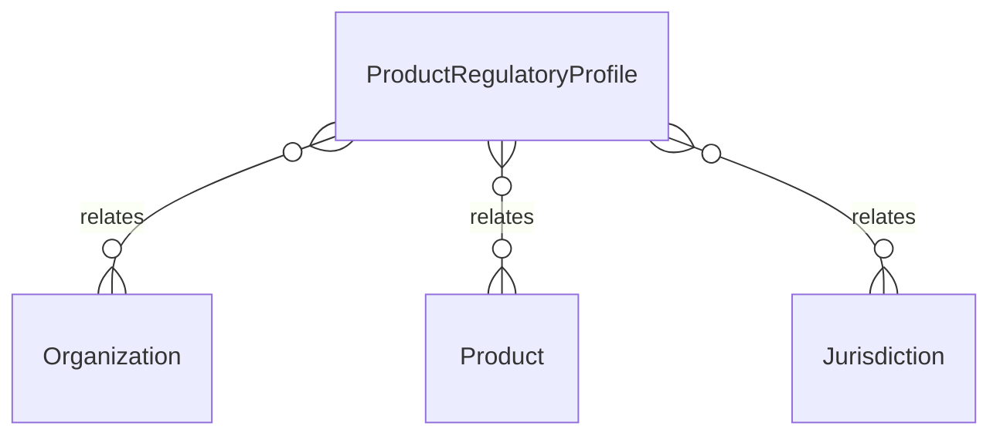

# `ProductRegulatoryProfile` → `product_regulatory_profiles`

<!-- generated by .kb/generate.mjs — do not edit by hand -->

Declared at `packages/db/prisma/schema/regulatory.prisma:499`.

| property | value |
| --- | --- |
| table | `product_regulatory_profiles` |
| tenant-scoped | yes — has `organizationId` |
| RLS | `platform_extensible` policy |
| columns | 15 |
| relations | 3 |

## Columns

| column | type | definition |
| --- | --- | --- |
| `id` | `String` | `id String @id @default(uuid()) @db.Uuid` |
| `organizationId` | `String?` | `organizationId String? @map("organization_id") @db.Uuid` |
| `productId` | `String` | `productId String @map("product_id") @db.Uuid` |
| `jurisdictionId` | `String` | `jurisdictionId String @map("jurisdiction_id") @db.Uuid` |
| `registrationNumber` | `String?` | `registrationNumber String? @map("registration_number") @db.VarChar(128)` |
| `registrationStatus` | `ProductRegistrationStatus` | `registrationStatus ProductRegistrationStatus @default(UNKNOWN) @map("registration_status")` |
| `classification` | `String?` | `classification String? @map("classification") @db.VarChar(64)` |
| `controlledSchedule` | `String?` | `controlledSchedule String? @map("controlled_schedule") @db.VarChar(64)` |
| `prescriptionRequirement` | `PrescriptionRequirement` | `prescriptionRequirement PrescriptionRequirement @default(UNKNOWN) @map("prescription_requirement")` |
| `onlineSalePosition` | `OnlineSalePosition` | `onlineSalePosition OnlineSalePosition @default(UNKNOWN) @map("online_sale_position")` |
| `dispensingNotes` | `String?` | `dispensingNotes String? @map("dispensing_notes") @db.Text` |
| `effectiveFrom` | `DateTime` | `effectiveFrom DateTime @map("effective_from") @db.Date` |
| `effectiveTo` | `DateTime?` | `effectiveTo DateTime? @map("effective_to") @db.Date` |
| `createdAt` | `DateTime` | `createdAt DateTime @default(now()) @map("created_at") @db.Timestamptz(6)` |
| `updatedAt` | `DateTime` | `updatedAt DateTime @updatedAt @map("updated_at") @db.Timestamptz(6)` |

## Relations

| field | target | definition |
| --- | --- | --- |
| `organization` | [`Organization`](Organization.md) | `organization Organization? @relation(fields: [organizationId], references: [id], onDelete: Cascade)` |
| `product` | [`Product`](Product.md) | `product Product? @relation(fields: [organizationId, productId], references: [organizationId, id], onDelete: Cascade)` |
| `jurisdiction` | [`Jurisdiction`](Jurisdiction.md) | `jurisdiction Jurisdiction @relation(fields: [jurisdictionId], references: [id], onDelete: Restrict)` |

## Indexes and constraints

- `@@unique([organizationId, productId, jurisdictionId, effectiveFrom])`
- `@@index([organizationId, jurisdictionId])`

## Neighbourhood

