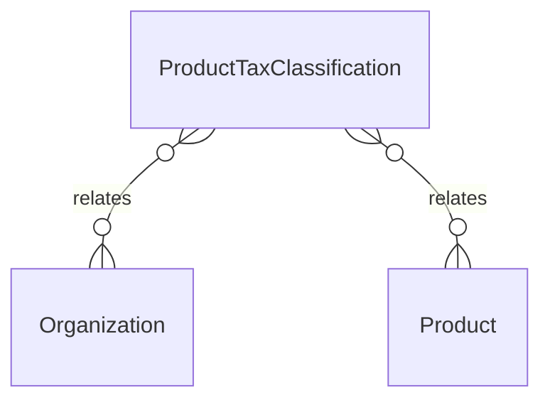

# `ProductTaxClassification` → `product_tax_classifications`

<!-- generated by .kb/generate.mjs — do not edit by hand -->

Declared at `packages/db/prisma/schema/products.prisma:890`.

| property | value |
| --- | --- |
| table | `product_tax_classifications` |
| tenant-scoped | yes — has `organizationId` |
| RLS | **MISSING — this is a tenant-isolation defect** |
| columns | 11 |
| relations | 2 |

## Columns

| column | type | definition |
| --- | --- | --- |
| `id` | `String` | `id String @id @default(uuid()) @db.Uuid` |
| `organizationId` | `String?` | `organizationId String? @map("organization_id") @db.Uuid` |
| `productId` | `String` | `productId String @map("product_id") @db.Uuid` |
| `countryCode` | `String` | `countryCode String @map("country_code") @db.Char(2)` |
| `regionCode` | `String?` | `regionCode String? @map("region_code") @db.VarChar(16)` |
| `taxCategory` | `String` | `taxCategory String @map("tax_category") @db.VarChar(64)` |
| `itemCode` | `String?` | `itemCode String? @map("item_code") @db.VarChar(32)` |
| `effectiveFrom` | `DateTime` | `effectiveFrom DateTime @map("effective_from") @db.Date` |
| `effectiveTo` | `DateTime?` | `effectiveTo DateTime? @map("effective_to") @db.Date` |
| `createdAt` | `DateTime` | `createdAt DateTime @default(now()) @map("created_at") @db.Timestamptz(6)` |
| `updatedAt` | `DateTime` | `updatedAt DateTime @updatedAt @map("updated_at") @db.Timestamptz(6)` |

## Relations

| field | target | definition |
| --- | --- | --- |
| `organization` | [`Organization`](Organization.md) | `organization Organization? @relation(fields: [organizationId], references: [id], onDelete: Cascade)` |
| `product` | [`Product`](Product.md) | `product Product? @relation(fields: [organizationId, productId], references: [organizationId, id], onDelete: Cascade)` |

## Indexes and constraints

- `@@unique([organizationId, productId, countryCode, regionCode, effectiveFrom])`

## Neighbourhood

