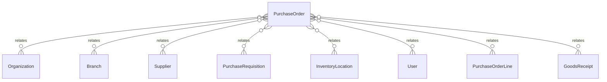

# `PurchaseOrder` → `purchase_orders`

<!-- generated by .kb/generate.mjs — do not edit by hand -->

Declared at `packages/db/prisma/schema/procurement.prisma:581`.

| property | value |
| --- | --- |
| table | `purchase_orders` |
| tenant-scoped | yes — has `organizationId` |
| RLS | `branch` policy |
| columns | 28 |
| relations | 11 |

## Columns

| column | type | definition |
| --- | --- | --- |
| `id` | `String` | `id String @id @default(uuid()) @db.Uuid` |
| `organizationId` | `String` | `organizationId String @map("organization_id") @db.Uuid` |
| `branchId` | `String` | `branchId String @map("branch_id") @db.Uuid` |
| `orderNumber` | `String?` | `orderNumber String? @map("order_number") @db.VarChar(64)` |
| `supplierId` | `String` | `supplierId String @map("supplier_id") @db.Uuid` |
| `requisitionId` | `String?` | `requisitionId String? @map("requisition_id") @db.Uuid` |
| `status` | `PurchaseOrderStatus` | `status PurchaseOrderStatus @default(DRAFT)` |
| `supplierName` | `String` | `supplierName String @map("supplier_name") @db.VarChar(255)` |
| `supplierTaxNumber` | `String?` | `supplierTaxNumber String? @map("supplier_tax_number") @db.VarChar(64)` |
| `currency` | `String` | `currency String @db.Char(3)` |
| `expectedDate` | `DateTime?` | `expectedDate DateTime? @map("expected_date") @db.Date` |
| `deliverToLocationId` | `String?` | `deliverToLocationId String? @map("deliver_to_location_id") @db.Uuid` |
| `subtotalMinor` | `BigInt` | `subtotalMinor BigInt @default(0) @map("subtotal_minor") @db.BigInt` |
| `taxAmountMinor` | `BigInt` | `taxAmountMinor BigInt @default(0) @map("tax_amount_minor") @db.BigInt` |
| `totalMinor` | `BigInt` | `totalMinor BigInt @default(0) @map("total_minor") @db.BigInt` |
| `terms` | `String?` | `terms String? @db.Text` |
| `notes` | `String?` | `notes String? @db.Text` |
| `createdById` | `String` | `createdById String @map("created_by_id") @db.Uuid` |
| `issuedAt` | `DateTime?` | `issuedAt DateTime? @map("issued_at") @db.Timestamptz(6)` |
| `issuedById` | `String?` | `issuedById String? @map("issued_by_id") @db.Uuid` |
| `closedAt` | `DateTime?` | `closedAt DateTime? @map("closed_at") @db.Timestamptz(6)` |
| `closedById` | `String?` | `closedById String? @map("closed_by_id") @db.Uuid` |
| `closureReason` | `String?` | `closureReason String? @map("closure_reason") @db.Text` |
| `cancelledAt` | `DateTime?` | `cancelledAt DateTime? @map("cancelled_at") @db.Timestamptz(6)` |
| `cancelledById` | `String?` | `cancelledById String? @map("cancelled_by_id") @db.Uuid` |
| `cancellationReason` | `String?` | `cancellationReason String? @map("cancellation_reason") @db.Text` |
| `createdAt` | `DateTime` | `createdAt DateTime @default(now()) @map("created_at") @db.Timestamptz(6)` |
| `updatedAt` | `DateTime` | `updatedAt DateTime @updatedAt @map("updated_at") @db.Timestamptz(6)` |

## Relations

| field | target | definition |
| --- | --- | --- |
| `organization` | [`Organization`](Organization.md) | `organization Organization @relation(fields: [organizationId], references: [id], onDelete: Cascade)` |
| `branch` | [`Branch`](Branch.md) | `branch Branch @relation(fields: [organizationId, branchId], references: [organizationId, id], onDelete: Cascade)` |
| `supplier` | [`Supplier`](Supplier.md) | `supplier Supplier @relation(fields: [organizationId, supplierId], references: [organizationId, id], onDelete: Restrict)` |
| `requisition` | [`PurchaseRequisition`](PurchaseRequisition.md) | `requisition PurchaseRequisition? @relation(fields: [organizationId, requisitionId], references: [organizationId, id], onDelete: Restrict)` |
| `deliverToLocation` | [`InventoryLocation`](InventoryLocation.md) | `deliverToLocation InventoryLocation? @relation("PurchaseOrderDeliverTo", fields: [organizationId, branchId, deliverToLocationId], references: [organizationId, branchId, id], onDelete: Restrict)` |
| `createdBy` | [`User`](User.md) | `createdBy User @relation("PurchaseOrderCreatedBy", fields: [createdById], references: [id], onDelete: Restrict)` |
| `issuedBy` | [`User`](User.md) | `issuedBy User? @relation("PurchaseOrderIssuedBy", fields: [issuedById], references: [id], onDelete: Restrict)` |
| `closedBy` | [`User`](User.md) | `closedBy User? @relation("PurchaseOrderClosedBy", fields: [closedById], references: [id], onDelete: Restrict)` |
| `cancelledBy` | [`User`](User.md) | `cancelledBy User? @relation("PurchaseOrderCancelledBy", fields: [cancelledById], references: [id], onDelete: Restrict)` |
| `lines` | [`PurchaseOrderLine`](PurchaseOrderLine.md) | `lines PurchaseOrderLine[]` |
| `goodsReceipts` | [`GoodsReceipt`](GoodsReceipt.md) | `goodsReceipts GoodsReceipt[]` |

## Indexes and constraints

- `@@unique([organizationId, orderNumber])`
- `@@unique([organizationId, id])`
- `@@unique([organizationId, branchId, id])`
- `@@index([organizationId, branchId, status, createdAt(sort: Desc)])`
- `@@index([organizationId, supplierId, status])`

## Neighbourhood

