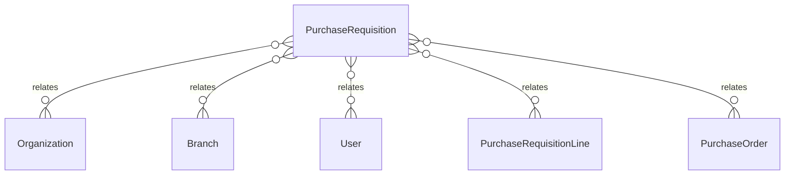

# `PurchaseRequisition` → `purchase_requisitions`

<!-- generated by .kb/generate.mjs — do not edit by hand -->

Declared at `packages/db/prisma/schema/procurement.prisma:437`.

| property | value |
| --- | --- |
| table | `purchase_requisitions` |
| tenant-scoped | yes — has `organizationId` |
| RLS | `branch` policy |
| columns | 19 |
| relations | 9 |

## Columns

| column | type | definition |
| --- | --- | --- |
| `id` | `String` | `id String @id @default(uuid()) @db.Uuid` |
| `organizationId` | `String` | `organizationId String @map("organization_id") @db.Uuid` |
| `branchId` | `String` | `branchId String @map("branch_id") @db.Uuid` |
| `requisitionNumber` | `String?` | `requisitionNumber String? @map("requisition_number") @db.VarChar(64)` |
| `status` | `PurchaseRequisitionStatus` | `status PurchaseRequisitionStatus @default(DRAFT)` |
| `requiredBy` | `DateTime?` | `requiredBy DateTime? @map("required_by") @db.Date` |
| `notes` | `String?` | `notes String? @db.Text` |
| `createdById` | `String` | `createdById String @map("created_by_id") @db.Uuid` |
| `submittedAt` | `DateTime?` | `submittedAt DateTime? @map("submitted_at") @db.Timestamptz(6)` |
| `submittedById` | `String?` | `submittedById String? @map("submitted_by_id") @db.Uuid` |
| `approvedAt` | `DateTime?` | `approvedAt DateTime? @map("approved_at") @db.Timestamptz(6)` |
| `approvedById` | `String?` | `approvedById String? @map("approved_by_id") @db.Uuid` |
| `rejectedAt` | `DateTime?` | `rejectedAt DateTime? @map("rejected_at") @db.Timestamptz(6)` |
| `rejectedById` | `String?` | `rejectedById String? @map("rejected_by_id") @db.Uuid` |
| `rejectionReason` | `String?` | `rejectionReason String? @map("rejection_reason") @db.Text` |
| `cancelledAt` | `DateTime?` | `cancelledAt DateTime? @map("cancelled_at") @db.Timestamptz(6)` |
| `cancelledById` | `String?` | `cancelledById String? @map("cancelled_by_id") @db.Uuid` |
| `createdAt` | `DateTime` | `createdAt DateTime @default(now()) @map("created_at") @db.Timestamptz(6)` |
| `updatedAt` | `DateTime` | `updatedAt DateTime @updatedAt @map("updated_at") @db.Timestamptz(6)` |

## Relations

| field | target | definition |
| --- | --- | --- |
| `organization` | [`Organization`](Organization.md) | `organization Organization @relation(fields: [organizationId], references: [id], onDelete: Cascade)` |
| `branch` | [`Branch`](Branch.md) | `branch Branch @relation(fields: [organizationId, branchId], references: [organizationId, id], onDelete: Cascade)` |
| `createdBy` | [`User`](User.md) | `createdBy User @relation("RequisitionCreatedBy", fields: [createdById], references: [id], onDelete: Restrict)` |
| `submittedBy` | [`User`](User.md) | `submittedBy User? @relation("RequisitionSubmittedBy", fields: [submittedById], references: [id], onDelete: Restrict)` |
| `approvedBy` | [`User`](User.md) | `approvedBy User? @relation("RequisitionApprovedBy", fields: [approvedById], references: [id], onDelete: Restrict)` |
| `rejectedBy` | [`User`](User.md) | `rejectedBy User? @relation("RequisitionRejectedBy", fields: [rejectedById], references: [id], onDelete: Restrict)` |
| `cancelledBy` | [`User`](User.md) | `cancelledBy User? @relation("RequisitionCancelledBy", fields: [cancelledById], references: [id], onDelete: Restrict)` |
| `lines` | [`PurchaseRequisitionLine`](PurchaseRequisitionLine.md) | `lines PurchaseRequisitionLine[]` |
| `purchaseOrders` | [`PurchaseOrder`](PurchaseOrder.md) | `purchaseOrders PurchaseOrder[]` |

## Indexes and constraints

- `@@unique([organizationId, requisitionNumber])`
- `@@unique([organizationId, id])`
- `@@unique([organizationId, branchId, id])`
- `@@index([organizationId, status, createdAt(sort: Desc)])`
- `@@index([organizationId, branchId, status])`

## Neighbourhood

